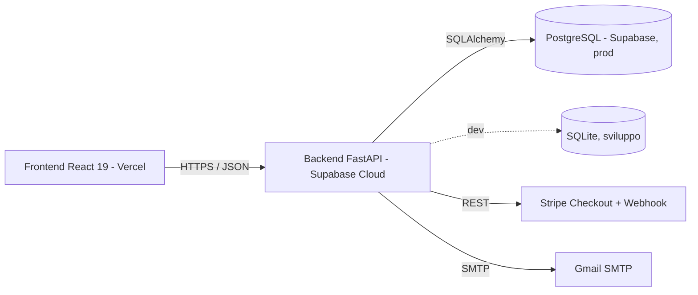
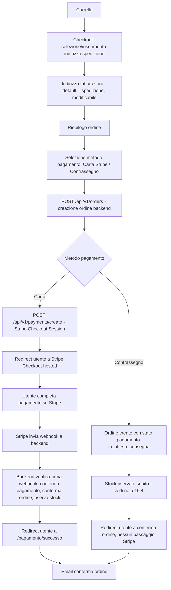
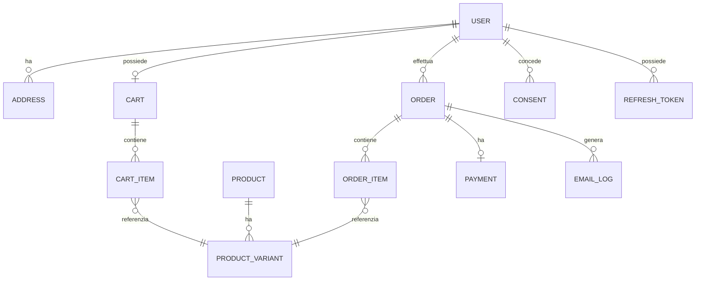

# PRD — Vesta
## Product Requirements Document — Frontend & Backend

**Versione:** 1.0
**Data:** 28 Agosto 2026
**Stato progetto:** Frontend esistente (React) → evoluzione verso applicazione full-stack (React + FastAPI + PostgreSQL)
**Destinatari:** Sviluppatore Frontend, Sviluppatore Backend, collaboratori futuri

---

## Indice

1. Executive Summary
2. Obiettivi
3. Scope
4. Non-scope
5. Codebase Audit (stato reale del progetto ZIP)
6. Architettura
7. Frontend Specification
8. Backend Specification
9. Autenticazione
10. Utenti
11. Prodotti e Varianti
12. Filtri
13. Paginazione
14. Carrello
15. Checkout
16. Pagamenti (Stripe)
17. Ordini
18. Spedizioni
19. Email
20. Marketing e Consensi
21. GDPR
22. Ruoli
23. Database
24. API Specification
25. HTTP Request/Response Flows
26. Frontend-Backend Contract
27. Sicurezza
28. Error Handling
29. Performance
30. Testing
31. Logging e Monitoring
32. Environment
33. Deployment
34. Roadmap
35. MVP
36. Future Features
37. Criteri di Accettazione
38. Decisioni Aperte Residue

---

## 1. Executive Summary

Vesta è un e-commerce di abbigliamento attualmente implementato come applicazione **frontend statica**: React 19 + Vite 8 + Tailwind CSS v4 + React Router DOM v7, con catalogo, dettaglio prodotto, recensioni e carrello funzionanti su dati JSON locali e persistenza in `localStorage`. Non esiste alcun backend, autenticazione, checkout, pagamento o persistenza server-side.

Questo documento definisce l'evoluzione di Vesta in un'applicazione full-stack production-ready (nei limiti di un progetto a budget zero), introducendo:

- un **backend FastAPI** ospitato su Supabase Cloud, con **PostgreSQL** come database di produzione (SQLite in sviluppo);
- un sistema di **autenticazione access/refresh token**;
- un **catalogo prodotti con varianti** (taglia × colore, stock per variante), filtri e paginazione **server-side**;
- un **carrello ibrido**: locale per utenti anonimi (come oggi), persistito server-side per utenti autenticati, con merge additivo al login;
- un **checkout riservato agli utenti registrati**, con validazione totale/prezzi/stock esclusivamente lato backend;
- **pagamenti Stripe** (Checkout hosted) + **contrassegno (COD)**;
- un ciclo di vita ordine/spedizione completo, con stock riservato alla conferma del pagamento e stato spedizione aggiornato manualmente da admin;
- **email transazionali** via SMTP Google per conferma ordine e cambi di stato spedizione, oltre al recupero password;
- un'area **amministrativa minimale** (solo API protette, no dashboard elaborata) per CRUD prodotti/varianti e gestione ordini/spedizioni.

Il backend è la **fonte autorevole** di tutti i dati critici (prezzi, sconti, stock, totali, stato ordine/pagamento/spedizione). Il frontend gestisce esclusivamente UI, UX, stato locale del carrello (per utenti anonimi) e chiamate API.

Il documento è stato costruito a partire da:
```
Requisiti iniziali forniti
        +
Analisi della codebase ZIP esistente (Codebase Audit, sezione 5)
        +
Intervista strutturata con il team (Decision Log integrato in ogni sezione)
        ↓
PRD definitivo
```

---

## 2. Obiettivi

- Trasformare Vesta da vetrina statica ad e-commerce funzionante end-to-end (catalogo → carrello → checkout → pagamento → ordine → spedizione → storico).
- Introdurre un backend che sia l'unica fonte autorevole per prezzi, sconti, stock, totali e stati.
- Mantenere piena compatibilità con l'architettura, le convenzioni e lo stile del frontend già esistente (nessun refactoring non necessario, nessuna nuova libreria non richiesta).
- Fornire uno strumento (questo PRD) sufficientemente esplicito da permettere a due sviluppatori diversi di implementare frontend e backend senza dover interpretare le reciproche intenzioni.
- Rispettare vincoli di budget zero (Supabase free tier, Vercel free tier, Stripe test mode, Gmail SMTP) segnalandone chiaramente i limiti operativi.

## 3. Scope

Incluso nell'MVP (dettaglio completo in sezione 35):

- Autenticazione completa (registrazione, login, refresh, logout, remember me, recupero password).
- Catalogo prodotti con varianti (taglia/colore/stock), filtri server-side, ricerca testuale, paginazione, ordinamento.
- Carrello ibrido locale/server-side con merge al login.
- Checkout per utenti registrati, con indirizzi di spedizione/fatturazione.
- Pagamento Stripe (Checkout hosted) + Contrassegno (COD).
- Creazione e gestione ordini, con stati ordine e stato spedizione distinti.
- Email transazionali: conferma ordine, spedizione confermata, spedizione consegnata, recupero password.
- Consenso marketing raccolto in fase di registrazione (senza gestione preferenze/campagne).
- Area admin (solo API + UI minimale): CRUD prodotti/varianti, gestione stato ordini/spedizioni.

## 4. Non-scope (rimandato a Future Features)

- Dashboard admin avanzata con statistiche/grafici.
- Statistiche cliente visibili al cliente stesso (LTV, segmento, ecc. — solo interne, e comunque rimandate).
- Gestione preferenze marketing granulari, campagne, tracking interazioni.
- Guest checkout (checkout senza account).
- Automazione temporale dello stato spedizione.
- Wishlist/Preferiti con persistenza reale (oggi è uno stub).
- Verifica email in registrazione.
- Selezione multi-corriere.
- Autenticazione a due fattori, login social/OAuth.
- Rimborsi parziali con interfaccia dedicata (il rimborso resta gestibile solo a livello dati/manuale in MVP, vedi sezione 16-17).

---

## 5. Codebase Audit — Stato reale del progetto ZIP

> Questa sezione riporta l'esito dell'analisi diretta del progetto fornito (`Vesta - Copia.zip`), eseguita prima di qualunque decisione progettuale, come richiesto.

### 5.1 Stack rilevato

React 19.2, Vite 8.1, Tailwind CSS v4.3 (via plugin `@tailwindcss/vite`), React Router DOM v7.18, react-icons 5.7, `@vis.gl/react-google-maps` 1.9 (probabile uso nella pagina Contatti, per una mappa). JavaScript puro, nessun TypeScript. Nessuna libreria HTTP, nessuna libreria di state management, nessuna libreria UI esterna. `eslint` configurato con `eslint-plugin-react-hooks` e `eslint-plugin-react-refresh`.

### 5.2 Struttura reale

```
src/
 ├─ App.jsx                    → routing piatto con Layout/Outlet
 ├─ component/
 │   ├─ layout/                → Layout, Navbar (+ Navbar-Components: SideBarMenu, SideBarCart, SearchBar), Footer
 │   ├─ pages/                 → 1 file per route + sottocartelle "NomePagina-Components" (es. Contatti-Components/Form.jsx, Layout/Prodotto.jsx)
 │   ├─ ui/                    → Hero (sottocartella), Banner, Widget*, e ui/layout/ (Card*, Stars)
 │   ├─ utilities/
 │   │   ├─ context/           → CartContext.jsx (unico Context esistente)
 │   │   ├─ Custom-Hook/       → ScreenSizeService.jsx, RecensioniService.jsx, ScrollToTop.jsx (non collegato, dead code)
 │   │   └─ function-utilities/→ cartService.js, prezzoService.js, prodottiService.js (i "Logic-JS")
 │   ├─ data/                  → prodotti.json, recensioni.json, recensioniProdotti.json
 │   └─ img/                   → asset locali (hero, categorie, banner)
 ├─ Public/                    → asset pubblici + logo SVG
 └─ Brand Identity/, UX/       → documentazione design (non codice)
```

La struttura rispetta già le convenzioni richieste (function component + `export default`, props destrutturate, `Array.isArray()` prima dei `.map()`/`.filter()`, naming booleani `isX`, nessun componente arrow function). **Nessuna cartella arbitraria** tipo `hooks/`, `services/`, `store/` è presente: verrà mantenuta questa impostazione anche nelle estensioni future.

### 5.3 Stato delle funzionalità

| Funzionalità | Stato | Dettaglio |
|---|---|---|
| Homepage | **IMPLEMENTATA** | Hero, categorie, nuovi arrivi, saldi, recensioni — presentazionale |
| Catalogo (`/catalogo`) | **IMPLEMENTATA (client-side)** | Tutti i 40 prodotti, ordinati per nome, nessun filtro/paginazione |
| Pagine Uomo/Donna/Bambini | **PARZIALMENTE IMPLEMENTATA** | `.filter()` locale su JSON per `categories` (che è in realtà il genere) |
| Pagina prodotto (`/prodotto/:id`) | **IMPLEMENTATA (client-side)** | Pattern loading/success/error con `isCurrent` già presente e riutilizzabile; legge da JSON locale tramite funzione async fittizia |
| Selezione taglia/colore in pagina prodotto | **NON IMPLEMENTATA (solo UI)** | Bottoni presenti ma senza stato/`onClick` funzionante |
| Ricerca testuale | **NON IMPLEMENTATA** | Input collegato a stato locale, nessuna logica di filtro/risultati |
| Paginazione | **NON IMPLEMENTATA** | Assente |
| Ordinamento | **NON IMPLEMENTATA** | Solo ordine alfabetico fisso in Catalogo |
| Carrello (add/remove/incrementa/decrementa/totale) | **IMPLEMENTATA** | `CartContext` + `cartService.js`, persistito in `localStorage` |
| Pagina Carrello (`/carrello`) | **PARZIALMENTE IMPLEMENTATA** | Markup provvisorio, nessun bottone checkout, `console.log` di debug da rimuovere |
| Sidebar Carrello (drawer) | **PARZIALMENTE IMPLEMENTATA / BUG** | Mostra sempre e solo lo stato "carrello vuoto" hardcoded: **non è collegata al `CartContext`** |
| Calcolo prezzo/sconto | **IMPLEMENTATA (con problema)** | `prezzoService.js` usa `Math.floor` per il troncamento e mischia number/string tramite `.toFixed(2)`; da non replicare lato backend |
| Wishlist/Preferiti | **NON IMPLEMENTATA** | Stub |
| Area utente | **NON IMPLEMENTATA** | Stub |
| Autenticazione | **NON IMPLEMENTATA** | Assente in toto |
| Checkout/Pagamento | **NON IMPLEMENTATA** | Assente in toto |
| Storico ordini | **NON IMPLEMENTATA** | Assente in toto |
| Recensioni prodotto | **IMPLEMENTATA (dati statici)** | Carousel funzionante, nessuna possibilità di scrittura recensione da parte utente |
| Pagine legali (Privacy, Cookie, Termini, Spedizioni, Resi) | **IMPLEMENTATA** | Contenuto statico |
| Responsive | **IMPLEMENTATA** | Hook `screenSize()` (breakpoint 1024px), mobile-first coerente |

### 5.4 Dati attuali — struttura reale verificata

**`prodotti.json`** (40 elementi):

```json
{
  "id": 15,
  "title": "Top blu navy",
  "subtitle": "Top essenziale blu navy",
  "description": "Top da donna in tessuto morbido e resistente.",
  "price": 29.99,
  "categories": "donna",
  "sale": 0,
  "newArrivals": true,
  "colors": [{ "nome": "Blu navy", "hex": "#22304A" }],
  "sizes": ["S", "M", "L"],
  "stock": 9,
  "image": "https://i.ibb.co/F4TSXDkm/prodotto-15.webp"
}
```

Osservazioni rilevanti per il backend:
- `categories` è in realtà il **genere** (valori osservati: `donna`, `uomo`, `bambina`, `bambino`), non la categoria merceologica. Non esiste alcun campo categoria/sottocategoria (es. "t-shirt", "jeans").
- Non esiste `slug`, non esiste SKU.
- Stock è un numero unico per prodotto: **non esistono varianti** con stock indipendente per combinazione taglia/colore.
- `sale` è una percentuale intera (valori osservati: 0, 20, 30, 40, 50).
- `image` è un URL esterno (ibb.co), non un asset locale.

**`recensioni.json`** (10 elementi): recensioni generiche per homepage (`Stars`, `Description`, `Name`, `City`), non collegate a un prodotto specifico.

**`recensioniProdotti.json`** (200 elementi): recensioni collegate a un prodotto tramite `productId`.

### 5.5 Logica esistente da riutilizzare

- **`cartService.js`**: `addToCart`, `removeFromCart`, `increaseQuantity`, `decreaseQuantity` — logica pura, resta valida per il carrello locale (utenti anonimi) anche dopo l'introduzione del backend.
- **`prezzoService.js`**: `calcoloPrezzoScontato(price, sale, newArrivals)` — da mantenere lato frontend per il solo scopo di visualizzazione, **mai come fonte di verità per il checkout**. Il backend implementerà una propria strategia di calcolo monetario (vedi sezione 16.5).
- **`CartContext.jsx`**: unico Context esistente, basato su `useState` + `localStorage`. Resta il punto di partenza per il carrello, esteso (non sostituito) con la logica di sincronizzazione server-side per utenti autenticati.
- **`prodottiService.js`**: `getProductById` — già asincrono con pattern try/catch compatibile con chiamate HTTP reali; sarà esteso con le nuove funzioni `getProducts`, `searchProducts`, mantenendo la stessa interfaccia.

### 5.6 Routing esistente

Piatto in `App.jsx`, tutte le route pubbliche, nessuna route privata. Path in italiano con trattini, minuscoli — coerente con i requisiti. Route esistente ma stub: `/utente`. Route da aggiungere: vedi sezione 7.4.

### 5.7 Bug/problemi da correggere (segnalati, non nel core del PRD funzionale ma necessari per l'MVP)

| Problema | Rischio | Soluzione | Obbligatorio/Consigliato |
|---|---|---|---|
| `SideBarCart` non collegata a `CartContext` (mostra sempre "carrello vuoto") | UX rotta, utente non vede il carrello nel drawer | Collegare il componente a `useContext(CartContext)` e renderizzare `CartCardProdotti` per ogni item, replicando il pattern già usato in `Carrello.jsx` | **OBBLIGATORIO** (blocca l'esperienza carrello attuale, indipendente dal backend) |
| `console.log` di debug in `Carrello.jsx` | Violazione qualità codice (sezione 28 delle istruzioni operative) | Rimuovere | **OBBLIGATORIO** |
| `prezzoService.js` usa `Math.floor` + mix number/string | Visualizzazione prezzo potenzialmente imprecisa | Da correggere lato frontend se necessario, ma **soprattutto** da non replicare lato backend (che userà calcolo in centesimi/interi, sezione 16.5) | **CONSIGLIATO** (frontend) / **OBBLIGATORIO** (backend, per la propria implementazione) |
| `ScrollToTop.jsx` presente ma non importato in `App.jsx` | Dead code | Da rimuovere solo se richiesto esplicitamente (le istruzioni operative vietano di introdurlo, ma non impongono la rimozione di codice inutilizzato esistente); segnalato, non rimosso in questo PRD | Segnalato, azione facoltativa |
| Pagina Carrello con markup provvisorio (`<h1>`, `bg-gray-400`) | Non coerente col design system | Da rifare secondo palette/design system esistente quando si implementa il checkout | **OBBLIGATORIO** (in fase di implementazione checkout) |

---

## 6. Architettura

### 6.1 Diagramma generale



### 6.2 Separazione delle responsabilità

**Frontend (React):** interfaccia, UX, navigazione, stato UI, rendering, validazione preliminare (client-side, solo per UX — mai sostitutiva della validazione backend), gestione form, chiamate API, gestione stati loading/success/error, visualizzazione dati ricevuti dal backend, carrello locale per utenti anonimi.

**Backend (FastAPI):** autenticazione, autorizzazione, database, utenti, prodotti/varianti, prezzi autorevoli, disponibilità/stock, ordini, pagamenti, spedizioni, email transazionali, consensi, validazione definitiva dei dati, business logic, API.

Il backend è sempre l'autorità su: prezzo, sconto, totale, stock, stato ordine, stato pagamento, stato spedizione, ruoli/autorizzazioni. Il frontend non invia mai un totale "di fiducia": lo calcola solo per mostrarlo, il backend lo ricalcola sempre da zero al checkout.

### 6.3 Fonte autorevole dei dati (Source of Truth)

| Dato | Source of Truth |
|---|---|
| Prezzo prodotto | Backend |
| Sconto | Backend |
| Totale ordine | Backend |
| Stock (per variante) | Backend |
| Dati utente / profilo | Backend |
| Sessione (access/refresh token) | Backend |
| Carrello UI (utente anonimo) | Frontend (localStorage) |
| Carrello persistito (utente loggato) | Backend |
| Stato ordine | Backend |
| Stato pagamento | Stripe (fonte primaria via webhook) + Backend (fonte applicativa, sincronizzata dal webhook) |
| Stato spedizione | Backend (aggiornato manualmente da admin) |
| Rendering / UI state | Frontend |
| Consenso marketing | Backend |

### 6.4 Ambienti

```
development → SQLite locale, FastAPI locale (uvicorn), frontend Vite dev server, Stripe test mode
production   → PostgreSQL (Supabase), FastAPI (Supabase Cloud), frontend su Vercel, Stripe test mode (nessun account business richiesto per l'MVP gratuito — vedi nota sezione 32)
```

Nessun ambiente di staging previsto per l'MVP (per decisione esplicita).
---

## 7. Frontend Specification

### 7.1 Principi generali

- JavaScript puro, nessun TypeScript.
- Nessuna nuova dipendenza oltre a quelle già presenti, salvo quanto esplicitamente indicato in questo documento (nessuna nuova dipendenza è richiesta per implementare l'MVP: `fetch` nativo è sufficiente per le chiamate HTTP).
- Componenti funzionali con `function NomeComponente() {} export default NomeComponente;`.
- Props destrutturate nei parametri.
- Logica di business separata dal JSX, nei relativi Logic-JS (`utilities/function-utilities/`).
- Pattern `loading` / `success` / `error` per ogni chiamata asincrona, con cleanup tramite `isCurrent` (già presente in `Prodotto.jsx`, da replicare in ogni nuovo componente che effettua fetch).
- Errori sempre in italiano.
- Nessun toast, skeleton o libreria di notifiche esterna: si riutilizzano gli stati `loading`/`success`/`error` già visualizzati inline, secondo lo stile esistente.

### 7.2 Struttura da estendere (nessuna nuova cartella arbitraria)

```
utilities/
 ├─ context/
 │   ├─ CartContext.jsx        (esistente, esteso con sync backend)
 │   └─ AuthContext.jsx        (NUOVO — stesso pattern architetturale di CartContext)
 ├─ Custom-Hook/
 │   └─ (screenSize, useRecensioniCarousel esistenti; eventuali nuovi hook seguono lo stesso stile: funzione che ritorna stato/handler)
 └─ function-utilities/
     ├─ cartService.js         (esistente, esteso)
     ├─ prezzoService.js       (esistente, invariato salvo bugfix visivo)
     ├─ prodottiService.js     (esistente, esteso con fetch reali)
     ├─ apiClient.js           (NUOVO — wrapper fetch centralizzato: base URL, header auth, gestione refresh token, parsing errori)
     ├─ authService.js         (NUOVO — login, registrazione, refresh, logout, recupero password)
     ├─ ordiniService.js       (NUOVO — creazione ordine, storico, dettaglio)
     ├─ indirizziService.js    (NUOVO — CRUD indirizzi utente)
     └─ pagamentiService.js    (NUOVO — avvio pagamento Stripe/COD)
```

Nessuna cartella `hooks/`, `services/`, `store/`, `lib/` viene introdotta: tutto resta dentro `utilities/`, coerente con la struttura esistente.

### 7.3 Nuovo AuthContext

Segue lo stesso stile architetturale di `CartContext.jsx` (Context + Provider con `useState`/`useEffect`, nessuna libreria esterna):

- Stato esposto: `user` (oggetto utente o `null`), `isAuthenticated` (booleano derivato), `isAuthLoading` (booleano, vero durante la verifica iniziale della sessione), `authError`.
- All'avvio dell'app (mount del `Provider`, in `main.jsx` o `App.jsx` a seconda di dove verrà collocato `CartProvider` oggi — da verificare in fase di implementazione dove è montato `CartProvider` e posizionare `AuthProvider` allo stesso livello), viene chiamato `GET /api/v1/auth/me` usando l'eventuale refresh token salvato, per ripristinare la sessione dopo refresh pagina/riapertura browser.
- Il token di accesso (`access_token`) viene mantenuto **in memoria** (stato React), **mai in `localStorage`** (rischio XSS). Il refresh token viene gestito secondo la strategia descritta in sezione 9.3 (cookie HttpOnly cross-site, con attenzione particolare a SameSite/Secure data la natura cross-origin di Vercel↔Supabase).
- Handler esposti: `login(email, password, rememberMe)`, `register(datiRegistrazione)`, `logout()`, `refreshSession()` (uso interno, richiamato automaticamente da `apiClient.js` alla scadenza dell'access token).

### 7.4 Route da aggiungere

```
/login                      → pubblica, redirect a "/" se già autenticato
/registrazione              → pubblica, redirect a "/" se già autenticato
/recupero-password          → pubblica
/reimposta-password/:token  → pubblica
/checkout                   → privata (richiede autenticazione)
/pagamento/successo         → privata
/pagamento/errore           → privata
/ordini                     → privata
/ordini/:id                 → privata
/utente                     → privata (già esistente come stub, da rendere privata e da implementare: dati profilo, indirizzi)
```

Comportamento su route privata senza autenticazione: redirect a `/login`, con eventuale parametro di redirect post-login (es. `?redirect=/checkout`) per riportare l'utente dove intendeva andare. Implementato tramite un componente `RouteProtetta` (o nome coerente, es. `RoutePrivata`) collocato in `component/layout/` (accanto a `Layout.jsx`, dato che agisce a livello di routing/layout), che avvolge le `Route` interessate in `App.jsx` e consulta `AuthContext`.

Le route amministrative (CRUD prodotti, gestione ordini) **non sono esposte come pagine del frontend pubblico Vesta in questo MVP**: sono API protette da ruolo `amministratore`, utilizzabili anche solo tramite client HTTP diretto (es. Postman) o una piccola interfaccia separata da definire in fase di implementazione (fuori dallo scope stretto di questo frontend, salvo diversa indicazione).

### 7.5 Correzioni da applicare (indipendenti dal backend, propedeutiche)

1. `SideBarCart.jsx`: collegare a `CartContext`, renderizzare la lista reale (`CartCardProdotti`) quando `cart.length > 0`, mantenendo lo stato "carrello vuoto" attuale come caso `cart.length === 0`.
2. `Carrello.jsx`: rimuovere i due `console.log`; sostituire il markup provvisorio (`<h1>`, `bg-gray-400`) con componenti coerenti col design system, aggiungendo il bottone "Procedi al checkout" (disabilitato/redirect a login se utente non autenticato, secondo la regola "solo utenti registrati").

---

## 8. Backend Specification

### 8.1 Stack

- **Python 3.12+**, **FastAPI**, **SQLAlchemy** (ORM) + **Alembic** (migrazioni, proposta tecnica standard con SQLAlchemy).
- **PostgreSQL** in produzione (Supabase), **SQLite** in sviluppo.
- **Pydantic v2** per validazione request/response (nativo in FastAPI).
- **Passlib/bcrypt** (o `argon2-cffi`) per hashing password — **proposta tecnica**: bcrypt è più diffuso e sufficiente per l'MVP.
- **python-jose** o **PyJWT** per la firma dei token JWT (access/refresh) — **proposta tecnica**.
- **Stripe Python SDK** per l'integrazione pagamenti.
- **smtplib**/**email.mime** (libreria standard Python) oppure **fastapi-mail** per l'invio email via SMTP Google — **proposta tecnica**: `fastapi-mail` semplifica la gestione asincrona, ma `smtplib` nativo è sufficiente e riduce le dipendenze; entrambe le opzioni sono compatibili con SMTP Google.

### 8.2 Struttura cartelle backend (proposta, dato che non esiste ancora backend nel progetto)

```
backend/
 ├─ app/
 │   ├─ main.py                → entry point FastAPI, mount router, CORS
 │   ├─ core/
 │   │   ├─ config.py          → variabili ambiente (Pydantic Settings)
 │   │   ├─ security.py        → hashing password, JWT, dipendenze auth
 │   │   └─ database.py        → engine SQLAlchemy, sessione DB
 │   ├─ models/                → modelli SQLAlchemy (User, Product, ProductVariant, Order, ...)
 │   ├─ schemas/                → schemi Pydantic (request/response)
 │   ├─ routers/                → un file per dominio (auth.py, users.py, products.py, orders.py, payments.py, addresses.py, admin_products.py, admin_orders.py)
 │   ├─ services/               → business logic (pricing, stock, email, stripe, jwt)
 │   └─ dependencies/           → dipendenze FastAPI (get_current_user, require_admin, get_db)
 ├─ alembic/                    → migrazioni
 ├─ scripts/
 │   └─ seed_products.py        → script di importazione iniziale da prodotti.json arricchito
 ├─ tests/
 └─ requirements.txt
```

> Nota: questa struttura è una **proposta tecnica standard FastAPI**, non vincolata da codice preesistente (il backend non esiste ancora nel progetto ZIP analizzato). Va confermata/adattata dallo sviluppatore backend in fase di bootstrap.

### 8.3 Convenzioni API generali

- Prefisso comune: `/api/v1`.
- Formato risposta di successo:
```json
{
  "success": true,
  "data": { }
}
```
- Formato risposta di errore (dettagli in sezione 28):
```json
{
  "success": false,
  "error": {
    "code": "VALIDATION_ERROR",
    "message": "I dati inseriti non sono validi.",
    "fields": { "email": "Inserisci un indirizzo email valido." }
  }
}
```
- Date sempre in **ISO 8601, UTC** (es. `2026-08-28T14:32:00Z`); la conversione al fuso orario locale avviene esclusivamente lato frontend.
- Valuta: **EUR**, unica valuta supportata nell'MVP.
- Prezzi: rappresentati in **centesimi (interi)** internamente nel database e nelle risposte API dedicate ai calcoli (per evitare errori di floating point), con un campo parallelo o una conversione esplicita in euro con 2 decimali per la visualizzazione (dettaglio in sezione 16.5).

---

## 9. Autenticazione

### 9.1 Strategia scelta: Access Token + Refresh Token

**Motivazione della scelta (per completezza, decisione già presa dal team):** con frontend (Vercel) e backend (Supabase) su domini diversi, l'uso di cookie di sessione HttpOnly "semplici" (same-site) non è praticabile: servirebbero cookie `SameSite=None; Secure`, funzionanti ma con maggiori complessità di configurazione CORS/credentials e comportamento meno prevedibile su alcuni browser/estensioni privacy. La coppia **access token (breve durata, in memoria) + refresh token (lunga durata)** è più flessibile in questo scenario cross-origin ed è la scelta effettuata dal team.

- **Access token**: JWT, durata **1 ora**, contiene `user_id`, `ruolo`, `exp`. Inviato dal frontend in header `Authorization: Bearer <token>` su ogni richiesta autenticata. Mantenuto **in memoria** nel frontend (variabile di stato in `AuthContext`), mai in `localStorage`/`sessionStorage`.
- **Refresh token**: token opaco (o JWT con solo `user_id` + `exp` + `jti` univoco), durata **30 giorni**, memorizzato **server-side** in una tabella `RefreshToken` (per poterlo revocare esplicitamente al logout) e restituito al frontend in un **cookie HttpOnly, Secure, SameSite=None** (necessario per cross-origin Vercel↔Supabase) puntato all'endpoint `/api/v1/auth/refresh`.

### 9.2 Flusso "Remember me"

Il flag "remember me" governa la **durata effettiva del refresh token**, non la sua natura:

- **Remember me attivo**: refresh token con scadenza piena a **30 giorni**, cookie persistente (`Max-Age` impostato di conseguenza).
- **Remember me non attivo**: refresh token con scadenza più breve, es. **1 giorno** (fino alla chiusura naturale della sessione "di navigazione"), cookie di sessione (senza `Max-Age`/`Expires`, così il browser lo elimina alla chiusura) — **proposta tecnica**, il valore esatto (1 giorno vs durata sessione browser) va confermato in fase di implementazione ma non blocca l'MVP.

Flusso completo:
```
1. Utente compila login, seleziona/deseleziona "Ricordami"
2. Frontend invia POST /api/v1/auth/login { email, password, rememberMe }
3. Backend valida credenziali
4. Backend genera access_token (1h) e refresh_token (30gg se rememberMe=true, altrimenti breve)
5. Backend salva il refresh_token (hash, non in chiaro) in tabella RefreshToken con relativa scadenza
6. Backend risponde: access_token nel body JSON + refresh_token in cookie HttpOnly/Secure/SameSite=None
7. Frontend salva access_token in memoria (AuthContext), aggiorna isAuthenticated=true
8. Ad ogni richiesta autenticata, apiClient.js allega Authorization: Bearer <access_token>
9. Se una richiesta fallisce con 401 (access token scaduto), apiClient.js chiama automaticamente POST /api/v1/auth/refresh (il cookie viene inviato automaticamente dal browser)
10. Se il refresh ha successo: nuovo access_token, richiesta originale ritentata automaticamente
11. Se il refresh fallisce (refresh token scaduto/revocato): logout forzato, redirect a /login
```

### 9.3 Comportamento al refresh pagina / riapertura browser

```
1. App si monta (AuthProvider)
2. isAuthLoading = true, user = null
3. Chiamata a POST /api/v1/auth/refresh (il cookie refresh_token, se presente e valido, viene inviato automaticamente)
4a. Successo → nuovo access_token ricevuto → chiamata GET /api/v1/auth/me → user popolato → isAuthenticated = true
4b. Fallimento (nessun cookie o scaduto) → user = null, isAuthenticated = false
5. isAuthLoading = false in entrambi i casi
6. Le route private consultano isAuthLoading prima di decidere se reindirizzare: finché isAuthLoading=true, mostrare uno stato di caricamento (coerente col pattern esistente, es. testo "Verifica sessione in corso...", nessuno skeleton)
```

### 9.4 Registrazione — Flusso completo

Campi richiesti: Nome, Cognome, email, password, conferma password (usata solo per validazione client-side, **mai inviata al backend**), consenso a comunicazioni commerciali (booleano, facoltativo — la registrazione non deve essere bloccata da un consenso negato).

```
1. Utente apre /registrazione
2. Compila il form (validazione client-side: email formato valido, password requisiti minimi, password === conferma password)
3. Submit → POST /api/v1/auth/register { nome, cognome, email, password, consensoCommerciale }
4. Backend valida input (Pydantic)
5. Backend verifica unicità email (case-insensitive)
   5a. Se email già esistente → 409 Conflict, errore "Questo indirizzo email è già registrato."
6. Backend crea l'utente (password hashata con bcrypt, MAI salvata in chiaro né la conferma password)
7. Backend salva il consenso commerciale con data/ora e origine ("registrazione")
8. Backend genera access_token + refresh_token (equivalente a un login automatico, remember me implicito = true per comodità post-registrazione — proposta tecnica, confermabile)
9. Backend risponde 201 Created con { user, access_token } + cookie refresh_token
10. Frontend riceve risposta, popola AuthContext (utente autenticato immediatamente, nessun secondo login richiesto)
11. Frontend reindirizza a "/" o alla pagina che aveva originato l'accesso al login/registrazione
```

Nessuna verifica email prevista nell'MVP (decisione esplicita): l'utente è pienamente operativo subito dopo la registrazione.

### 9.5 Login — Flusso completo

```
CLIENT (form login)
   ↓
POST /api/v1/auth/login { email, password, rememberMe }
   ↓
FASTAPI ROUTER (routers/auth.py)
   ↓
VALIDAZIONE input (Pydantic: email formato, password non vuota)
   ↓
BUSINESS LOGIC: query utente per email → verifica hash password (bcrypt.verify)
   ↓
Se credenziali non valide (email inesistente O password errata) → risposta IDENTICA in entrambi i casi:
   401 Unauthorized, { error: { code: "INVALID_CREDENTIALS", message: "Email o password non corretti." } }
   (anti user-enumeration; nota: essendo previsto un solo metodo di login email+password, questa scelta resta comunque buona pratica anche se il team non l'ha ritenuta un problema esplicito)
   ↓
Se credenziali valide → genera access_token + refresh_token, salva refresh token hashato in DB
   ↓
RESPONSE: { success: true, data: { user: {...}, access_token: "..." } } + Set-Cookie refresh_token
   ↓
CLIENT: AuthContext aggiornato, isAuthenticated = true, redirect a "/" o a redirect party
```

### 9.6 Logout

```
1. Frontend chiama POST /api/v1/auth/logout (con access_token in header, cookie refresh_token inviato automaticamente)
2. Backend identifica il refresh token dal cookie, lo REVOCA esplicitamente in DB (elimina/marca invalido il record in tabella RefreshToken — non basta far scadere il tempo, va invalidato subito)
3. Backend risponde 200 OK e istruisce il browser a cancellare il cookie (Set-Cookie con Max-Age=0)
4. Frontend: AuthContext resettato (user=null, isAuthenticated=false, access_token in memoria cancellato)
5. Frontend reindirizza a "/" (le route private, se l'utente vi si trovava, faranno scattare il redirect a /login al prossimo render grazie a isAuthenticated=false)
```

Nota: il carrello locale (localStorage) **non viene svuotato** al logout: resta disponibile per l'utente anonimo o per un successivo login (dove verrà nuovamente unito al carrello server-side, sezione 14).

### 9.7 Recupero password — Flusso completo

Incluso nell'MVP per decisione esplicita.

```
1. Utente su /recupero-password inserisce la propria email
2. POST /api/v1/auth/password-reset/request { email }
3. Backend: se l'email esiste, genera un token temporaneo monouso (es. 1 ora di validità), lo salva hashato in DB associato all'utente
4. Backend invia email con link "https://vesta-frontend.vercel.app/reimposta-password/{token}" (SMTP Google)
5. Backend risponde SEMPRE 200 OK con messaggio generico ("Se l'indirizzo è registrato, riceverai un'email con le istruzioni.") indipendentemente dal fatto che l'email esista o meno — anti user-enumeration
6. Utente clicca il link, apre /reimposta-password/:token
7. Utente inserisce nuova password + conferma
8. POST /api/v1/auth/password-reset/confirm { token, nuovaPassword }
9. Backend valida il token (esistenza, scadenza, non già utilizzato), aggiorna la password (nuovo hash), invalida il token e — per sicurezza — REVOCA tutti i refresh token attivi dell'utente (logout forzato da altri dispositivi)
10. Backend risponde 200 OK
11. Frontend reindirizza a /login con messaggio di conferma
```

### 9.8 Stato di autenticazione — cosa deve sapere il frontend

Tramite `AuthContext`, in ogni momento il frontend conosce:
- `isAuthenticated` (booleano)
- `user` (con almeno: `id`, `nome`, `cognome`, `email`, `ruolo`)
- `isAuthLoading` (booleano — vero solo durante la verifica iniziale)
- `authError` (eventuale errore dell'ultima operazione di auth, in italiano)

`GET /api/v1/auth/me` restituisce l'utente corrente identificato dall'access token in header; usato sia al bootstrap (dopo un refresh riuscito) sia per rileggere i dati utente aggiornati dopo una modifica profilo.
---

## 10. Utenti

### 10.1 Modello dati Account

| Campo | Tipo | Obbligatorio | Note |
|---|---|---|---|
| id | UUID/serial | sì | PK |
| nome | string | sì | |
| cognome | string | sì | |
| email | string | sì | unique, case-insensitive |
| password_hash | string | sì | bcrypt, mai esposto in risposta API |
| genere | enum(`uomo`,`donna`,`altro`) | no | facoltativo, modificabile da profilo |
| data_nascita | date | no | facoltativo |
| telefono | string | no | facoltativo |
| ruolo | enum(`cliente`,`amministratore`) | sì | default `cliente` |
| data_registrazione | datetime | sì | auto, UTC |
| ultimo_accesso | datetime | no | aggiornato ad ogni login riuscito |

La "conferma password" del form di registrazione **non è un campo del modello**: esiste solo lato frontend per validazione UX, non viene mai inviata al backend.

### 10.2 Endpoint profilo

`GET /api/v1/users/me` — restituisce i dati utente correnti (senza `password_hash`).
`PATCH /api/v1/users/me` — aggiorna i campi modificabili: nome, cognome, telefono, genere, data_nascita. **L'email non è modificabile da questo endpoint** (cambiare email è un'operazione sensibile, fuori scope MVP — se richiesta in futuro, andrà protetta con verifica). Il cambio password richiede un endpoint dedicato `PATCH /api/v1/users/me/password` che richiede la password attuale + la nuova password (mai la sola nuova password, per evitare furto di sessione = furto di account).

---

## 11. Indirizzi

### 11.1 Modello

Un utente può avere più indirizzi salvati, ciascuno marcato come `tipo` (`spedizione` o `fatturazione`) e con un flag `predefinito`.

| Campo | Tipo | Obbligatorio |
|---|---|---|
| id | UUID/serial | sì |
| user_id | FK → User | sì |
| tipo | enum(`spedizione`,`fatturazione`) | sì |
| via | string | sì |
| cap | string | sì |
| citta | string | sì |
| provincia | string | sì |
| paese | string | sì |
| note_consegna | string | no (solo per tipo `spedizione`) |
| predefinito | boolean | sì, default false |

### 11.2 Endpoint

```
GET    /api/v1/users/me/addresses
POST   /api/v1/users/me/addresses
PATCH  /api/v1/users/me/addresses/:id
DELETE /api/v1/users/me/addresses/:id
```
Ownership: ogni operazione verifica che l'indirizzo appartenga all'utente autenticato (403 altrimenti).

### 11.3 Regola fatturazione = spedizione di default

Come da decisione: in fase di checkout, il frontend precompila l'indirizzo di fatturazione con gli stessi dati dell'indirizzo di spedizione selezionato, con possibilità per l'utente di modificarlo esplicitamente (checkbox "Usa un indirizzo di fatturazione diverso"). Questo è **comportamento del form di checkout**, non un vincolo del modello dati: l'utente può comunque avere indirizzi di fatturazione salvati indipendenti.

### 11.4 Snapshot nell'ordine

Importante: gli indirizzi usati in un ordine **non sono un riferimento (FK) all'indirizzo del profilo**, ma uno **snapshot** (copia dei campi) salvato direttamente nell'ordine al momento della creazione. Se l'utente modifica o cancella successivamente l'indirizzo nel proprio profilo, lo storico ordini non cambia. Dettaglio in sezione 17.3.

---

## 12. Prodotti e Varianti

### 12.1 Migrazione dal modello JSON attuale

Il modello attuale (`prodotti.json`) va **arricchito**, non sostituito nella sostanza. Cambiamenti rispetto all'attuale:

| Campo attuale | Nel nuovo modello | Nota |
|---|---|---|
| `categories` (stringa, in realtà genere) | `genere` (enum: `uomo`,`donna`,`bambino`,`bambina`) | Rinominato per chiarezza, stesso dominio di valori |
| — (assente) | `categoria` / `sottocategoria` (stringa o FK a tabella Category) | **Nuovo campo, dato mancante nei 40 prodotti attuali**: andrà assegnato manualmente in fase di seed (es. "T-shirt", "Jeans", "Felpe"...) |
| — (assente) | `slug` | Nuovo, generato da `title` (es. "top-blu-navy") |
| `colors` + `sizes` (array separati, stock unico) | `ProductVariant` (combinazione taglia × colore, con proprio stock e SKU) | Cambiamento strutturale: introduzione varianti |
| `stock` (numero unico sul prodotto) | spostato su `ProductVariant.stock` | Il prodotto non ha più uno stock proprio: è la somma/disponibilità delle sue varianti |
| `price` | `prezzo_originale` (in centesimi internamente) | |
| `sale` (percentuale) | `percentuale_sconto` | Invariato concettualmente |
| `image` | `immagini` (array di URL, per supportare più foto per prodotto in futuro — MVP può averne anche solo 1) | Restano URL esterni (ibb.co), nessuno storage backend |
| `newArrivals` | `nuovo_arrivo` (booleano) | Invariato concettualmente |
| `description`, `subtitle`, `title` | invariati (rinominati in italiano per coerenza: `descrizione`, `sottotitolo`, `titolo`) | — |

### 12.2 Modello dati Prodotto

| Campo | Tipo | Obbligatorio | Note |
|---|---|---|---|
| id | UUID/serial | sì | PK |
| titolo | string | sì | |
| sottotitolo | string | no | |
| descrizione | text | sì | |
| slug | string | sì | unique |
| genere | enum | sì | uomo/donna/bambino/bambina |
| categoria | string (o FK Category) | sì | es. "T-shirt" — **proposta tecnica**: tabella `Category` separata per coerenza/gestione admin, oppure stringa libera per semplicità MVP. **DA DECIDERE** (non bloccante: si può partire con stringa libera e migrare a tabella dedicata in futuro senza impatti sul frontend, se l'API resta `categoria: string`) |
| prezzo_originale_centesimi | integer | sì | prezzo in centesimi |
| percentuale_sconto | integer (0-100) | sì | default 0 |
| nuovo_arrivo | boolean | sì | default false |
| immagini | array di string (URL) | sì | almeno 1 |
| attivo | boolean | sì | default true — permette di "nascondere" un prodotto senza cancellarlo (soft delete) |
| data_creazione | datetime | sì | auto |

### 12.3 Modello dati ProductVariant

| Campo | Tipo | Obbligatorio | Note |
|---|---|---|---|
| id | UUID/serial | sì | PK |
| product_id | FK → Product | sì | |
| taglia | string | sì | es. "S","M","L","XL" |
| colore_nome | string | sì | es. "Blu navy" |
| colore_hex | string | sì | es. "#22304A" |
| sku | string | sì | unique |
| stock | integer | sì | ≥ 0 |

Vincolo: combinazione `(product_id, taglia, colore_nome)` unique.

### 12.4 Prezzo finale — calcolo

`prezzo_finale_centesimi = prezzo_originale_centesimi - round(prezzo_originale_centesimi * percentuale_sconto / 100)`, calcolato **sempre lato backend**, mai fidandosi di un valore inviato dal client. Dettaglio strategia monetaria in sezione 16.5.

### 12.5 Endpoint prodotti pubblici

```
GET /api/v1/products              → lista con filtri/paginazione (sezione 13)
GET /api/v1/products/:slug        → dettaglio prodotto (con varianti e stock aggregato)
```

> Nota: si usa `:slug` invece di `:id` per URL più leggibili e coerenti con `/prodotto/:id` esistente nel frontend — **da confermare in fase di implementazione se il frontend continuerà a usare l'id numerico nell'URL (`/prodotto/15`) o passerà allo slug (`/prodotto/top-blu-navy`)**. Per minimizzare l'impatto sul routing frontend esistente, la raccomandazione è **mantenere l'id nell'URL frontend** (`/prodotto/:id`) e usare l'id anche come parametro nell'endpoint (`GET /api/v1/products/:id`), riservando lo slug a un eventuale uso SEO futuro. Questo PRD userà quindi `:id` negli esempi seguenti.

### 12.6 Endpoint amministrativi prodotti (CRUD)

```
POST   /api/v1/admin/products                    → crea prodotto (con almeno 1 variante)
PATCH  /api/v1/admin/products/:id                 → modifica dati prodotto
DELETE /api/v1/admin/products/:id                 → soft delete (attivo=false)
POST   /api/v1/admin/products/:id/variants        → aggiunge variante
PATCH  /api/v1/admin/products/:id/variants/:variant_id  → modifica variante (es. stock)
DELETE /api/v1/admin/products/:id/variants/:variant_id  → rimuove variante
```
Tutti protetti da `ruolo = amministratore` (401 se non autenticato, 403 se autenticato ma non admin).

### 12.7 Script di seed iniziale

`scripts/seed_products.py`: legge una versione arricchita di `prodotti.json` (con `categoria` assegnata manualmente per ciascuno dei 40 prodotti, dato mancante nell'origine) e genera, per ciascun prodotto, le relative `ProductVariant` a partire dagli array `sizes` × `colors` esistenti, distribuendo lo stock originale (unico) tra le varianti generate secondo una regola semplice (es. equamente diviso, oppure tutto sulla prima variante con le altre a stock ridotto) — **DA DECIDERE in fase di seed, non impatta l'architettura**: è solo una scelta di dati di esempio, il modello resta lo stesso indipendentemente da come si distribuisce lo stock iniziale.

---

## 13. Filtri (server-side)

### 13.1 Principio

Il frontend non scarica più l'intero catalogo per filtrarlo localmente. Ogni combinazione di filtri genera una query string sull'endpoint `GET /api/v1/products`, che il backend traduce in una query SQL filtrata.

### 13.2 Query parameters supportati

| Parametro | Tipo | Esempio | Note |
|---|---|---|---|
| `genere` | string | `uomo` | uomo/donna/bambino/bambina |
| `categoria` | string | `t-shirt` | |
| `taglia` | string | `M` | filtra prodotti che hanno almeno una variante con quella taglia e stock > 0 |
| `colore` | string | `Blu navy` | idem per colore |
| `prezzoMin` | number (euro) | `20` | confrontato su prezzo finale scontato |
| `prezzoMax` | number (euro) | `80` | |
| `soloDisponibili` | boolean | `true` | esclude prodotti con stock aggregato = 0 |
| `soloScontati` | boolean | `true` | `percentuale_sconto > 0` |
| `q` | string | `top blu` | ricerca testuale su titolo/sottotitolo/descrizione (case-insensitive, `ILIKE`/`unaccent` in Postgres) |
| `sort` | enum | `price_asc` | valori: `price_asc`, `price_desc`, `newest`, `relevance` (default se `q` presente), `name_asc` (default se nessun sort specificato e nessuna ricerca) |
| `page` | integer | `1` | default 1 |
| `limit` | integer | `24` | default 24, max 60 (limite tecnico per evitare payload eccessivi) |

Esempio:
```http
GET /api/v1/products?genere=uomo&categoria=t-shirt&prezzoMin=20&prezzoMax=80&page=1&limit=24&sort=price_asc
```

### 13.3 Validazione e valori non validi

- Parametri non riconosciuti vengono **ignorati silenziosamente** (non generano errore, per tolleranza verso eventuali evoluzioni del frontend).
- Parametri con valore in formato non valido (es. `prezzoMin=abc`) generano `422 Unprocessable Entity` con dettaglio del campo non valido.
- `prezzoMin > prezzoMax`: **422**, errore esplicito "Il prezzo minimo non può superare il prezzo massimo."
- Filtri combinati con AND logico (es. `genere=uomo&taglia=M` → prodotti uomo che hanno la taglia M disponibile).
- Nessun risultato: risposta 200 OK con `data: []` e `pagination.totalItems: 0` (non è un errore).

### 13.4 Comportamento frontend

- I filtri selezionati vengono **sincronizzati con i query parameters dell'URL** (`useSearchParams` di React Router v7), così da rendere l'URL condivisibile/bookmarkabile e coerente col back/forward del browser.
- Un bottone "Reimposta filtri" pulisce i query parameters e ricarica la lista senza filtri.
- Ricerca testuale (`SearchBar`, già presente nel Navbar): al submit, naviga verso `/catalogo?q=<query>`, riutilizzando lo stesso meccanismo di filtro.

---

## 14. Paginazione (server-side)

### 14.1 Formato risposta

```json
{
  "success": true,
  "data": [ ],
  "pagination": {
    "page": 1,
    "limit": 24,
    "totalItems": 120,
    "totalPages": 5,
    "hasNextPage": true,
    "hasPreviousPage": false
  }
}
```

### 14.2 Regole

- Default: `page=1`, `limit=24`.
- `limit` massimo consentito: 60 (richieste con `limit` superiore vengono silenziosamente limitate a 60, non generano errore).
- `page` oltre l'ultima pagina disponibile: risposta 200 OK con `data: []` (non 404 — è uno stato legittimo, non un errore).
- L'ordinamento (`sort`) è sempre applicato **prima** della paginazione, a livello di query SQL (mai in memoria).

### 14.3 Comportamento frontend

- Componente `Paginazione` (nuovo, in `component/ui/`) riutilizzabile, riceve `pagination` come prop e un handler `onPageChange`.
- Il numero di pagina è anch'esso sincronizzato con l'URL (`?page=2`).

---

## 15. Carrello

### 15.1 Comportamento per utenti anonimi (invariato rispetto ad oggi)

Il carrello resta gestito **interamente lato frontend**, tramite `CartContext` + `cartService.js` + persistenza in `localStorage`, esattamente come già implementato. Nessuna chiamata backend per utenti non autenticati.

### 15.2 Comportamento per utenti autenticati (nuovo)

Per decisione esplicita del team, gli utenti loggati hanno **anche** una persistenza server-side del carrello (utile su cambio dispositivo).

Modello dati:

**Cart**: `id`, `user_id` (FK, unique — un solo carrello attivo per utente), `data_aggiornamento`.
**CartItem**: `id`, `cart_id` (FK), `product_variant_id` (FK), `quantita`.

> Nota: il carrello persistito referenzia la **variante** (`product_variant_id`), non il prodotto generico, dato che ora esistono varianti con stock indipendente. Questo è un cambiamento rispetto al carrello locale attuale (che referenzia solo `id` prodotto): il frontend dovrà, quando introdurrà la selezione di taglia/colore in pagina prodotto (oggi solo UI decorativa, sezione 5.3), aggiungere al carrello la combinazione `productId + variantId` invece del solo `productId`. Questo è un cambiamento necessario e diretto conseguenza della decisione "varianti con stock indipendente fin da subito" (Blocco C, punto 11) — segnalato qui perché impatta il `cartService.js` esistente.

### 15.3 Endpoint carrello server-side

```
GET    /api/v1/cart                      → carrello dell'utente autenticato (con dettagli prodotto/variante espansi)
POST   /api/v1/cart/items                → aggiunge una variante { productVariantId, quantita }
PATCH  /api/v1/cart/items/:id            → modifica quantità
DELETE /api/v1/cart/items/:id            → rimuove un item
DELETE /api/v1/cart                      → svuota il carrello
```

Il backend valida ad ogni modifica che `quantita <= stock` disponibile della variante (senza però bloccare rigidamente in questa fase: un controllo bloccante rigoroso avviene comunque, e in modo definitivo, al checkout — sezione 16).

### 15.4 Merge al login

```
1. Utente con carrello locale (localStorage) effettua login
2. Frontend, subito dopo un login riuscito, legge il carrello locale corrente
3. Se il carrello locale non è vuoto: frontend chiama POST /api/v1/cart/merge con la lista { productVariantId, quantita }[] del carrello locale
   (NOTA: questo richiede che il carrello locale, una volta introdotta la selezione varianti in pagina prodotto, salvi productVariantId e non solo productId — vedi 15.2)
4. Backend somma le quantità: per ogni item, se la variante è già nel carrello server-side, quantita_finale = quantita_esistente + quantita_locale; altrimenti crea un nuovo CartItem
5. Backend risponde con il carrello server-side aggiornato (fonte di verità dopo il merge)
6. Frontend sostituisce lo stato di CartContext con il carrello server-side ricevuto, e svuota/allinea il localStorage di conseguenza (il localStorage continua ad esistere come cache locale sincronizzata, utile se l'utente naviga offline momentaneamente — ma il backend resta la fonte quando l'utente è autenticato)
```

### 15.5 Comportamento CartContext esteso

`CartContext` viene esteso (non sostituito) per:
- Consultare `AuthContext` (o ricevere `isAuthenticated` come dipendenza) per sapere se operare in modalità locale o remota.
- Se autenticato: ogni operazione (add/remove/update quantità) chiama l'endpoint corrispondente e aggiorna lo stato con la risposta del backend.
- Se anonimo: comportamento identico a oggi (solo `localStorage`).
- Al login: esegue il merge (15.4). Al logout: torna in modalità locale, il carrello locale (se presente) resta quello che era prima del login (non viene ri-scaricato dal server, dato che dopo il logout non c'è più un carrello server accessibile).
---

## 16. Checkout e Pagamenti

### 16.1 Flusso completo (panoramica)



### 16.2 Checkout — solo utenti registrati

Come da decisione, non è previsto guest checkout. La route `/checkout` è protetta (sezione 7.4): un utente anonimo che tenta di accedervi viene reindirizzato a `/login?redirect=/checkout`.

### 16.3 Passi del checkout (dettaglio frontend → backend)

1. **Indirizzo di spedizione**: l'utente seleziona un indirizzo salvato tra quelli restituiti da `GET /api/v1/users/me/addresses` (tipo=spedizione) oppure ne inserisce uno nuovo (che può opzionalmente salvare per il futuro).
2. **Indirizzo di fatturazione**: precompilato uguale alla spedizione, con checkbox per differenziarlo.
3. **Riepilogo**: il frontend mostra un riepilogo **basato sui dati del carrello locale/remoto per UX**, ma questo riepilogo è puramente informativo — **non è la base del calcolo finale**.
4. **Creazione ordine**: il frontend invia al backend **solo gli identificativi** (varianti + quantità + indirizzi + metodo di pagamento scelto), **mai prezzi o totali**:

```http
POST /api/v1/orders
Authorization: Bearer <access_token>
Content-Type: application/json
```
```json
{
  "items": [
    { "productVariantId": "uuid-variante-1", "quantita": 2 },
    { "productVariantId": "uuid-variante-2", "quantita": 1 }
  ],
  "indirizzoSpedizione": { "via": "...", "cap": "...", "citta": "...", "provincia": "...", "paese": "...", "noteConsegna": "..." },
  "indirizzoFatturazione": { "via": "...", "cap": "...", "citta": "...", "provincia": "...", "paese": "..." },
  "metodoPagamento": "carta",
  "codiceSconto": "PROMO10"
}
```
5. Il **backend ricalcola tutto da zero**: per ogni `productVariantId` recupera prezzo corrente, sconto corrente, disponibilità; valida il coupon se presente; calcola subtotale, sconti, IVA, totale finale. Se un prodotto non esiste più, è disattivato, o la quantità richiesta supera lo stock disponibile: **422 Unprocessable Entity** con dettaglio per item, l'ordine non viene creato, il frontend mostra l'errore in italiano e invita a rivedere il carrello.
6. Se la validazione passa, il backend crea l'ordine in stato iniziale `in_attesa` (vedi sezione 17) **senza ancora scalare lo stock** (lo stock viene riservato solo alla conferma del pagamento, per decisione esplicita — sezione 16.4) e risponde con l'ordine creato, incluso il totale autorevole:

```json
{
  "success": true,
  "data": {
    "order": {
      "id": "uuid-ordine",
      "numeroOrdine": "VST-2026-000123",
      "stato": "in_attesa",
      "totale": 8998,
      "valuta": "EUR",
      "metodoPagamento": "carta"
    }
  }
}
```

### 16.4 Riserva dello stock — momento e gestione della concorrenza

**Decisione confermata**: lo stock viene riservato **alla conferma del pagamento**, non alla creazione dell'ordine.

Questo introduce un rischio esplicito, che va gestito:

> **Rischio**: tra la creazione dell'ordine (passo 6 sopra) e la conferma effettiva del pagamento (redirect Stripe, tempo indefinito nelle mani dell'utente), un altro utente potrebbe acquistare l'ultima unità disponibile di una variante. Al momento della conferma pagamento, lo stock potrebbe non essere più sufficiente.

**Soluzione obbligatoria**: al momento della conferma pagamento (sia per webhook Stripe che per contrassegno), il backend esegue, all'interno di una **transazione database con lock** (es. `SELECT ... FOR UPDATE` sulla riga della variante, supportato sia da PostgreSQL che, con limitazioni, da SQLite in dev), un controllo finale di disponibilità **prima** di scalare lo stock e confermare l'ordine:

```
BEGIN TRANSACTION
  FOR EACH item IN ordine.items:
    SELECT stock FROM product_variant WHERE id = item.variant_id FOR UPDATE
    IF stock < item.quantita:
      ROLLBACK
      → ordine.stato = "annullato_stock_insufficiente"
      → SE pagamento carta già incassato da Stripe → avviare RIMBORSO AUTOMATICO integrale via Stripe API
      → inviare email al cliente che spiega l'annullamento e il rimborso
      → STOP
  FOR EACH item IN ordine.items:
    UPDATE product_variant SET stock = stock - item.quantita WHERE id = item.variant_id
  ordine.stato = "confermato"
COMMIT
```

Questo è l'unico punto del sistema in cui è necessario un lock esplicito, ed è **obbligatorio** per evitare overselling. Per il contrassegno, lo stesso identico controllo/transazione avviene sincronicamente al momento della creazione/conferma ordine (non c'è un webhook esterno da attendere, quindi la "conferma pagamento" per COD coincide temporalmente con la creazione ordine stessa, ma segue comunque la stessa logica transazionale).

### 16.5 Strategia monetaria (floating point)

**Obbligatorio**: tutti i calcoli monetari nel backend avvengono in **interi (centesimi)**, mai in `float`. Esempio: 29,99 € è memorizzato e calcolato come `2999` (integer). La conversione a rappresentazione decimale (`29.99`) avviene solo nella risposta JSON finale (come number con 2 decimali, o come stringa formattata — **proposta tecnica**: number, per semplicità di consumo frontend, es. `29.99`, sapendo che JSON non ha un tipo "decimale esatto" ma la conversione avviene una sola volta in uscita, senza ulteriori operazioni aritmetiche su quel valore).

Arrotondamento sconti: `round()` (arrotondamento standard, non troncamento come nell'attuale `prezzoService.js` frontend) applicato sempre sui centesimi interi.

### 16.6 Pagamento con Stripe — architettura

**Flusso: Stripe Checkout Session (hosted, redirect)** — scelta del team, la più semplice da integrare e la più sicura (Vesta non gestisce mai i dati carta, che restano su dominio Stripe).

```http
POST /api/v1/payments/create
Authorization: Bearer <access_token>
```
```json
{ "orderId": "uuid-ordine" }
```

Backend:
1. Verifica che l'ordine appartenga all'utente e sia in stato `in_attesa`.
2. Crea una **Stripe Checkout Session** (`stripe.checkout.Session.create`) con:
   - `line_items` ricostruiti dal backend (mai dal client) a partire dagli item dell'ordine già validati/prezzati;
   - `mode="payment"`;
   - `success_url = "https://vesta-frontend.vercel.app/pagamento/successo?orderId={orderId}"`;
   - `cancel_url = "https://vesta-frontend.vercel.app/pagamento/errore?orderId={orderId}"`;
   - `metadata = { "order_id": orderId }` (fondamentale: permette al webhook di ricollegare l'evento Stripe all'ordine Vesta);
   - `client_reference_id = orderId`.
3. Risponde al frontend con `{ checkoutUrl: "https://checkout.stripe.com/..." }`.
4. Il frontend esegue `window.location.href = checkoutUrl` (redirect completo, non popup — coerente con "hosted checkout").

**Webhook Stripe:**

```http
POST /api/v1/payments/webhook
Stripe-Signature: <firma>
```

- Il backend **verifica sempre la firma** (`stripe.Webhook.construct_event`) usando il webhook signing secret (variabile ambiente, mai hardcoded) — **obbligatorio**, altrimenti chiunque potrebbe simulare un pagamento riuscito.
- Eventi gestiti nell'MVP: `checkout.session.completed` (pagamento riuscito → eseguire il flusso di conferma/riserva stock di 16.4), `checkout.session.expired` (sessione scaduta senza pagamento → ordine resta/torna `in_attesa` o passa ad `annullato` dopo un timeout — **proposta tecnica**: annullare automaticamente l'ordine se la sessione scade, liberando eventuali riferimenti).
- **Idempotenza webhook obbligatoria**: Stripe può inviare lo stesso evento più volte. Il backend deve controllare, prima di processare, se l'evento (`event.id`) è già stato processato (tabella `WebhookEvent` con `stripe_event_id` unique, oppure verifica che l'ordine non sia già in stato `confermato`) — se già processato, rispondere comunque `200 OK` senza rieseguire la logica.
- Risposta sempre rapida (`200 OK` entro pochi secondi): eventuali operazioni lunghe (invio email) vanno eseguite dopo aver garantito la consistenza transazionale di stock/ordine, idealmente in modo che un eventuale fallimento dell'invio email **non** comprometta la conferma dell'ordine (l'email è un side-effect, non deve essere nella stessa transazione critica — vedi sezione 19.4 per retry).

### 16.7 Casi limite pagamento (obbligatorio gestirli)

| Caso | Comportamento richiesto |
|---|---|
| Utente chiude la pagina Stripe senza pagare | L'ordine resta `in_attesa`. Nessun webhook arriva (o arriva `checkout.session.expired` alla scadenza naturale della sessione, tipicamente 24h). L'utente può ritentare il pagamento dalla pagina ordine/carrello. |
| Pagamento riuscito ma il frontend non riceve mai la redirect di successo (es. connessione caduta dopo il pagamento) | Il webhook arriva comunque al backend **indipendentemente dal frontend**: l'ordine viene confermato lato server. L'utente, tornando su `/ordini`, vedrà comunque l'ordine confermato. Il frontend non deve mai considerare un ordine "pagato" solo perché è arrivato sulla pagina di successo: quella pagina fa una `GET /api/v1/orders/:id` per leggere lo stato reale. |
| Il webhook arriva prima della redirect utente | Nessun problema: sono canali indipendenti, il backend è già la fonte di verità quando il frontend interroga `GET /api/v1/orders/:id`. |
| Il webhook arriva due volte | Gestito dall'idempotenza (16.6). |
| Pagamento fallito (carta rifiutata) | Stripe gestisce il retry direttamente nella sua pagina hosted; se l'utente abbandona, si ricade nel caso "sessione scaduta". Nessun evento di "fallimento" esplicito da gestire oltre a `checkout.session.expired` nell'MVP. |
| Pagamento resta "pending" (es. metodi con conferma differita — non previsti nell'MVP dato che si usa solo carta, ma la Checkout Session lo supporta come concetto generale) | Fuori scope MVP: con solo carta Stripe, il completamento è tipicamente immediato. Segnalato come nota per eventuali metodi futuri. |
| Doppio click su "Paga" | Il frontend disabilita il bottone dopo il primo click (stato `loading` già nel pattern esistente) finché non riceve risposta da `POST /api/v1/payments/create`. Lato backend, se esiste già una Checkout Session attiva e non scaduta per quell'ordine, viene riutilizzata invece di crearne una nuova (evita sessioni duplicate) — **obbligatorio**. |
| Connessione che cade dopo l'avvio del pagamento ma prima del redirect | L'utente, ricaricando o tornando sul sito, troverà lo stato reale dell'ordine leggendolo dal backend (mai da uno stato locale ottimistico). |

### 16.8 Contrassegno (COD)

Flusso semplificato, nessuna interazione con Stripe:

```
1. POST /api/v1/orders con metodoPagamento="contrassegno"
2. Backend valida/crea l'ordine come per il flusso carta (stesso ricalcolo prezzi/stock)
3. Essendo "conferma pagamento" immediata per definizione (si paga alla consegna), il backend esegue subito la transazione di riserva stock (sezione 16.4) e porta l'ordine a stato "confermato", con pagamento.stato = "in_attesa_consegna" (si distingue dallo stato "pagato" usato per Stripe)
4. Redirect diretto a /pagamento/successo (nessun passaggio esterno)
5. Email di conferma ordine inviata normalmente, specificando il metodo di pagamento come contrassegno
```

### 16.9 Rimborsi

Fuori scope come funzionalità con interfaccia dedicata nell'MVP (rimandata a Future Features come da decisione punto 21 del blocco H), **ad eccezione del rimborso automatico obbligatorio nel caso di stock insufficiente post-pagamento** (sezione 16.4), che è un requisito di correttezza transazionale e non una feature UI: viene eseguito via Stripe API (`stripe.Refund.create`) senza intervento admin.

Un endpoint minimo `POST /api/v1/admin/orders/:id/refund` (rimborso manuale totale, admin-only) è incluso nell'MVP come parte della gestione ordini admin (sezione 22.2), ma senza UI dedicata elaborata (form semplice).

---

## 17. Ordini

### 17.1 Stati Ordine

```
in_attesa → confermato → in_preparazione → spedito → consegnato
                ↓
           annullato
                ↓
           rimborsato
```

| Stato | Descrizione | Impostato da |
|---|---|---|
| `in_attesa` | Ordine creato, pagamento non ancora confermato | Backend, alla creazione |
| `confermato` | Pagamento confermato (webhook Stripe o COD immediato), stock riservato | Backend, automatico |
| `in_preparazione` | L'admin ha iniziato a preparare la spedizione | Admin, manuale |
| `spedito` | Pacco affidato al corriere | Admin, manuale |
| `consegnato` | Consegna avvenuta | Admin, manuale |
| `annullato` | Ordine annullato (mai pagato, o stock insufficiente post-pagamento) | Backend automatico (stock insufficiente) o Admin (annullamento manuale prima della spedizione) |
| `rimborsato` | Importo restituito al cliente | Admin (rimborso manuale) o Backend automatico (caso 16.4) |

### 17.2 Transizioni consentite

| Da → A | Consentita? | Chi |
|---|---|---|
| in_attesa → confermato | sì | Sistema (automatico via webhook/COD) |
| in_attesa → annullato | sì | Sistema (sessione Stripe scaduta) o Admin |
| confermato → in_preparazione | sì | Admin |
| confermato → annullato | sì (solo se non ancora spedito) | Admin — **deve** innescare il rimborso (sezione 16.9) e ripristinare lo stock delle varianti |
| in_preparazione → spedito | sì | Admin |
| spedito → consegnato | sì | Admin |
| spedito → annullato | **no** | — (una volta spedito, l'unica via indietro è il rimborso post-consegna/reso, fuori scope MVP) |
| consegnato → rimborsato | sì (caso reso, gestito manualmente admin) | Admin |
| qualunque stato → stato precedente | **no** | Nessuna transizione all'indietro salvo i casi esplicitamente elencati sopra |

Ogni cambio di stato che comporta ripristino stock (annullamento pre-spedizione) o rimborso Stripe deve avvenire nella stessa logica transazionale già descritta in 16.4 (lock, aggiornamento atomico).

### 17.3 Modello dati Ordine (con snapshot)

| Campo | Tipo | Note |
|---|---|---|
| id | UUID | PK |
| numero_ordine | string | generato, es. `VST-2026-000123`, unique, human-readable |
| user_id | FK → User | |
| data_creazione | datetime | UTC |
| stato | enum | vedi 17.1 |
| subtotale_centesimi | integer | somma prezzi originali |
| sconto_totale_centesimi | integer | |
| codice_sconto_applicato | string, nullable | snapshot del codice usato, se presente |
| iva_centesimi | integer | vedi nota IVA sotto |
| totale_centesimi | integer | |
| metodo_pagamento | enum(`carta`,`contrassegno`) | |
| indirizzo_spedizione_snapshot | JSON (o tabella separata OrderAddress) | copia campi, non FK |
| indirizzo_fatturazione_snapshot | JSON (o tabella separata OrderAddress) | copia campi, non FK |
| stato_spedizione | enum | vedi sezione 18, separato da `stato` ordine |
| corriere | string, nullable | valorizzato quando lo stato spedizione passa a "spedito" |
| tracking_number | string, nullable | idem |
| tracking_url | string, nullable | idem |

**Nota IVA**: il documento iniziale richiede di tracciare l'IVA nello storico ordini. **DA DECIDERE**: se i prezzi prodotto sono da considerarsi già IVA inclusa (prassi comune per e-commerce B2C in Italia) o IVA esclusa. **Raccomandazione**: prezzi visualizzati **IVA inclusa** (aliquota 22% inclusa nel prezzo mostrato al cliente, come da prassi B2C italiana), con l'ordine che riporta comunque la scomposizione (`iva_centesimi` calcolato come parte del totale, non aggiunto sopra) per finalità di fattura/scontrino. Questo non richiede logica complessa: `iva_centesimi = round(totale_centesimi - totale_centesimi / 1.22)`.

**OrderItem** (righe ordine, con relativo snapshot):

| Campo | Tipo | Note |
|---|---|---|
| id | UUID | |
| order_id | FK | |
| product_variant_id | FK → ProductVariant | riferimento comunque mantenuto per statistiche/gestione, ma... |
| nome_prodotto_snapshot | string | ...i dati descrittivi sono duplicati (snapshot) per non dipendere da futuri cambi/cancellazioni prodotto |
| taglia_snapshot | string | |
| colore_snapshot | string | |
| prezzo_unitario_centesimi_snapshot | integer | prezzo al momento dell'acquisto, non il prezzo attuale del prodotto |
| quantita | integer | |
| sconto_percentuale_snapshot | integer | |

### 17.4 Endpoint ordini

```
POST /api/v1/orders                → crea ordine (sezione 16.3)
GET  /api/v1/orders                → storico ordini dell'utente autenticato, paginato
GET  /api/v1/orders/:id            → dettaglio ordine (ownership verificata: 403 se l'ordine non appartiene all'utente, salvo ruolo admin)
```

Storico paginato, stesso formato paginazione della sezione 14, con eventuale filtro per stato (`?stato=consegnato`) e ordinamento per data (default: più recente prima).

### 17.5 Endpoint amministrativi ordini

```
GET   /api/v1/admin/orders                      → lista tutti gli ordini, filtrabile per stato/utente
GET   /api/v1/admin/orders/:id                   → dettaglio (nessuna restrizione ownership per admin)
PATCH /api/v1/admin/orders/:id/status            → cambia stato ordine (rispettando le transizioni consentite di 17.2)
PATCH /api/v1/admin/orders/:id/shipment          → aggiorna stato spedizione/corriere/tracking (sezione 18)
POST  /api/v1/admin/orders/:id/refund            → rimborso manuale totale
```

---

## 18. Spedizioni

### 18.1 Stato spedizione — separato dallo stato ordine

Come richiesto, lo stato spedizione è un campo distinto dallo stato ordine, aggiornato **esclusivamente manualmente dall'admin** (Opzione A, decisione confermata — nessuna automazione temporale).

Stati spedizione: `in_attesa`, `confermato`, `spedito`, `consegnato`.

Esempio di evoluzione tipica (non automatica, ogni passo richiede un'azione admin esplicita):

```
Ordine.stato = confermato   |  Spedizione.stato = in_attesa
Ordine.stato = in_preparazione | Spedizione.stato = confermato
Ordine.stato = spedito      |  Spedizione.stato = spedito   (qui admin inserisce corriere + tracking)
Ordine.stato = consegnato   |  Spedizione.stato = consegnato
```

> Nota di coerenza: dato che il documento richiede stati ordine e stati spedizione come concetti separati ma con un'evoluzione parallela, la **raccomandazione tecnica** è che l'aggiornamento dello stato ordine (`in_preparazione`, `spedito`, `consegnato`) e il corrispondente stato spedizione vengano **aggiornati insieme dallo stesso endpoint admin** (`PATCH /api/v1/admin/orders/:id/status`), per evitare che i due stati si disallineino per errore umano. Il campo `stato_spedizione` esiste comunque come colonna distinta nel modello dati (sezione 17.3) per rispettare il requisito di separazione concettuale, ma nella pratica operativa dell'MVP i due stati avanzano in coppia. Se in futuro servisse un disallineamento reale (es. "ordine confermato" ma spedizione già "in_attesa" per giorni), il modello lo supporta già.

### 18.2 Corriere fisso

Come da decisione, un solo corriere per l'MVP (nome configurabile via variabile ambiente o valore fisso in seed, es. "BRT" o altro nome a scelta del team in fase di implementazione — non specificato nei requisiti, quindi **DA DECIDERE** solo come valore letterale, non come architettura). Non è previsto un endpoint di integrazione con API di corrieri reali: `corriere`, `tracking_number`, `tracking_url` sono inseriti manualmente dall'admin come testo libero.

### 18.3 Endpoint

Incluso nell'endpoint `PATCH /api/v1/admin/orders/:id/shipment` (sezione 17.5):

```json
{
  "statoSpedizione": "spedito",
  "corriere": "BRT",
  "trackingNumber": "1Z999AA10123456784",
  "trackingUrl": "https://vesta-corriere.example/track/1Z999AA10123456784"
}
```

Questo aggiornamento, quando lo stato passa a `spedito`, **innesca l'invio dell'email "Spedito"** (sezione 19).
---

## 19. Email

### 19.1 Provider

**SMTP Google (Gmail)**, come da decisione. Configurazione tramite variabili ambiente (`SMTP_HOST`, `SMTP_PORT`, `SMTP_USER`, `SMTP_APP_PASSWORD` — mai credenziali nel codice). Richiede la generazione di una "Password per le app" nell'account Google (l'autenticazione OAuth2 completa è un'alternativa più complessa, **fuori scope MVP**).

> **Limite segnalato (obbligatorio da conoscere, non blocca l'MVP)**: Gmail SMTP impone un limite di circa 500 email/giorno per account gratuito (2000 per Google Workspace). Per un progetto MVP/didattico a basso volume è accettabile; se il volume di ordini crescesse, andrebbe sostituito con un provider transazionale dedicato (es. Resend, SendGrid — già menzionati come alternative nella fase di analisi, ora rimandate).

### 19.2 Email previste nell'MVP

| Email | Trigger | Contenuto minimo |
|---|---|---|
| Conferma ordine | Ordine passa a stato `confermato` (pagamento riuscito o COD) | Nome cliente, numero ordine, data, prodotti (nome, taglia, colore, quantità, prezzo), sconti, totale, IVA, indirizzo spedizione, indirizzo fatturazione, metodo pagamento, stato ordine |
| Spedizione confermata | Stato spedizione → `spedito` (contestuale allo stato ordine `spedito`, sezione 18.1) | Numero ordine, corriere, numero tracking, link tracking |
| Consegnato | Stato spedizione → `consegnato` | Numero ordine, conferma avvenuta consegna |
| Recupero password | Richiesta reset password (sezione 9.7) | Link con token temporaneo (validità 1 ora) |

Non incluse nell'MVP (per decisione esplicita, restano rimandate): email di benvenuto separata dalla conferma ordine, email pagamento fallito/annullato, email di rimborso automatizzata (il rimborso da stock insufficiente può comunque generare una email semplice di cortesia — **proposta tecnica facoltativa**, non richiesta esplicitamente ma consigliata per trasparenza verso il cliente in un caso comunque anomalo; se non implementata nell'MVP va segnalata come gap noto), nessuna email di marketing/campagna.

### 19.3 Architettura invio

- Servizio dedicato `services/email_service.py` nel backend, con funzioni pure per tipo di email (`invia_email_conferma_ordine(ordine)`, `invia_email_spedizione(ordine)`, `invia_email_consegnato(ordine)`, `invia_email_reset_password(utente, token)`).
- Template: **HTML semplice** generato via stringhe/f-string Python o piccoli template Jinja2 (**proposta tecnica**: Jinja2, già presente come dipendenza di FastAPI stesso, evita di aggiungere nuove dipendenze). Nessun sistema di template engine esterno complesso richiesto per l'MVP.
- L'invio email **non deve mai bloccare o compromettere** la transazione critica che lo precede (es. conferma ordine, cambio stato spedizione): l'aggiornamento di stato viene sempre committato per primo; l'invio email avviene come passo successivo, con gestione errore isolata (se l'invio fallisce, l'ordine resta comunque confermato correttamente).

### 19.4 Gestione errori, retry, logging, idempotenza

- **Log**: ogni tentativo di invio email viene registrato (tabella `EmailLog`: `id`, `tipo`, `order_id` nullable, `destinatario`, `stato` (`inviata`/`fallita`), `data_invio`, `errore` nullable). Questo permette di verificare cosa è stato inviato e diagnosticare fallimenti, oltre a fornire la base per l'idempotenza.
- **Idempotenza**: prima di inviare, il backend verifica se esiste già un `EmailLog` con esito `inviata` per quella combinazione `(order_id, tipo)` — se sì, non reinvia (evita doppie email in caso di webhook duplicati o retry applicativi).
- **Retry**: **proposta tecnica minimale per l'MVP** (nessuna coda/job system introdotta, per restare proporzionati): un singolo retry sincrono immediato in caso di fallimento (es. errore di connessione SMTP transitorio), poi si registra come `fallita` in `EmailLog` senza ulteriori tentativi automatici. Un meccanismo di retry differito/schedulato è rimandato a Future Features se il volume lo giustificasse (introdurrebbe la necessità di un job scheduler, oggi non presente e non richiesto).

---

## 20. Marketing e Consensi

### 20.1 Scope MVP

Per decisione esplicita, l'MVP si limita a **raccogliere e salvare il consenso commerciale** al momento della registrazione. Nessuna gestione di preferenze granulari (email/SMS/push separati), nessuna funzionalità di iscrizione/disiscrizione autonoma, nessuna campagna, nessun tracciamento di interazioni.

### 20.2 Modello dati Consent

| Campo | Tipo | Note |
|---|---|---|
| id | UUID | |
| user_id | FK | |
| tipo | string | `commerciale` (unico tipo nell'MVP; il campo esiste comunque come stringa/enum estendibile per il futuro) |
| concesso | boolean | |
| data_concessione | datetime | UTC |
| origine | string | es. `registrazione` |
| versione_informativa | string | riferimento alla versione del testo privacy/informativa mostrata all'utente al momento del consenso — **importante per GDPR**, anche nell'MVP minimale (sezione 21) |

Non viene creata nell'MVP una tabella `MarketingPreference` separata (menzionata nei requisiti iniziali come entità possibile): il solo consenso booleano con relativo audit trail (data, origine, versione) è sufficiente per lo scope attuale. La distinzione concettuale CONSENSO / PREFERENZA / ISCRIZIONE NEWSLETTER resta comunque valida come principio: nell'MVP esiste solo il CONSENSO; PREFERENZA e ISCRIZIONE NEWSLETTER (come entità autonome, gestibili indipendentemente dalla registrazione) sono rimandate a Future Features.

---

## 21. GDPR

Anche nello scope ridotto dell'MVP, alcuni requisiti tecnici minimi di supporto alla conformità GDPR restano **obbligatori** (non sono negoziabili in funzione dello scope, essendo requisiti legali/di sicurezza di base):

- **Minimizzazione dati**: si raccolgono solo i dati elencati in questo documento (nessun campo aggiuntivo non giustificato).
- **Consenso tracciabile**: data/ora, origine, versione informativa (sezione 20.2) — già incluso nel modello.
- **Revoca**: nell'MVP il consenso può essere revocato solo tramite un endpoint `PATCH /api/v1/users/me/consent` (aggiorna `concesso=false`, con nuovo record di audit o aggiornamento del record esistente con timestamp di modifica) — **minimale ma presente**, anche se non c'è una pagina "preferenze" elaborata.
- **Diritto alla cancellazione**: **DA DECIDERE l'implementazione tecnica esatta** — la richiesta di cancellazione account potrebbe confliggere con l'obbligo di conservare lo storico ordini (per motivi fiscali/contabili, tipicamente 10 anni in Italia). **Raccomandazione**: implementare una "anonimizzazione" dell'account (sostituzione di nome/cognome/email con placeholder, mantenendo gli ordini come dati storici anonimizzati) piuttosto che una cancellazione fisica (`DELETE`) dell'utente. Questo è rimandato a Future Features per l'implementazione API completa, ma va segnalato come requisito noto.
- **Sicurezza dati**: password mai in chiaro, mai restituite in nessuna risposta API (nemmeno l'hash), token gestiti secondo sezione 9, HTTPS obbligatorio in produzione (garantito da Vercel/Supabase di default).
- **Retention**: **DA DECIDERE** in modo specifico (durata di conservazione dati utenti inattivi, log, ecc.) — non bloccante per l'MVP, da validare legalmente prima del lancio pubblico reale.

> Il team è invitato a far validare legalmente (non tecnicamente) l'informativa privacy e i testi di consenso prima di un lancio pubblico reale: questo documento definisce solo i requisiti tecnici di supporto, non costituisce consulenza legale.

---

## 22. Ruoli

### 22.1 Ruoli MVP

`cliente` (default) e `amministratore`.

**Cliente**: accesso a profilo proprio, indirizzi propri, carrello proprio, ordini propri (ownership sempre verificata), gestione consenso proprio.

**Amministratore**: tutto quanto sopra come utente normale, **più** accesso agli endpoint `/api/v1/admin/*`: CRUD prodotti/varianti, visualizzazione/gestione di tutti gli ordini, cambio stato ordine/spedizione, rimborso manuale.

### 22.2 Come si diventa amministratore

Non è previsto un endpoint pubblico di "auto-promozione" (ovviamente). **Proposta tecnica per l'MVP**: il ruolo amministratore viene assegnato manualmente a livello di database (es. tramite lo script di seed iniziale, o un comando/script separato eseguito dal team, non tramite API), dato che non è previsto un pannello di gestione utenti nell'MVP. Questo è coerente con la decisione di rimandare la dashboard admin avanzata (che includerebbe la gestione ruoli) a Future Features.

### 22.3 Autorizzazione — dipendenza FastAPI

Tutti gli endpoint `/api/v1/admin/*` sono protetti da una dipendenza `require_admin` (in `dependencies/`) che: verifica il JWT valido (come `get_current_user`), poi verifica `user.ruolo == "amministratore"`, altrimenti `403 Forbidden` con messaggio "Non hai i permessi per accedere a questa risorsa."

---

## 23. Database

### 23.1 Entità e relazioni (panoramica)



### 23.2 Elenco entità con dettaglio (integrazione di quanto già descritto nelle sezioni precedenti)

| Entità | Sezione di riferimento con i campi completi |
|---|---|
| User | Sezione 10.1 |
| Address | Sezione 11.1 |
| RefreshToken | Sezione 9.1 (id, user_id, token_hash, data_scadenza, revocato) |
| Product | Sezione 12.2 |
| ProductVariant | Sezione 12.3 |
| Cart | Sezione 15.2 |
| CartItem | Sezione 15.2 |
| Order | Sezione 17.3 |
| OrderItem | Sezione 17.3 |
| Payment | Nuova entità, vedi 23.3 |
| Consent | Sezione 20.2 |
| EmailLog | Sezione 19.4 |
| WebhookEvent | Sezione 16.6 (id, stripe_event_id unique, data_ricezione) |
| Coupon | Vedi 23.4 |

### 23.3 Entità Payment (dettaglio non ancora esplicitato altrove)

| Campo | Tipo | Note |
|---|---|---|
| id | UUID | |
| order_id | FK → Order, unique | un pagamento per ordine nell'MVP (no pagamenti parziali/multipli) |
| metodo | enum(`carta`,`contrassegno`) | |
| stato | enum(`in_attesa`,`pagato`,`in_attesa_consegna`,`fallito`,`rimborsato`) | `in_attesa_consegna` usato solo per COD |
| stripe_checkout_session_id | string, nullable | solo per metodo carta |
| stripe_payment_intent_id | string, nullable | valorizzato dal webhook |
| importo_centesimi | integer | |
| data_creazione | datetime | |
| data_conferma | datetime, nullable | |

### 23.4 Coupon (menzionato nei requisiti iniziali, sezione 16.3 di questo PRD lo referenzia come `codiceSconto`)

Il documento iniziale menziona i coupon come funzionalità da supportare nel calcolo del totale, ma **nessuna decisione è stata presa dal team** su regole/gestione coupon (creazione, tipologie, validità, admin). **DA DECIDERE**, segnalato anche in sezione 38.

Modello minimo proposto (solo come base tecnica, da confermare):

| Campo | Tipo | Note |
|---|---|---|
| id | UUID | |
| codice | string, unique | es. "PROMO10" |
| tipo | enum(`percentuale`,`importo_fisso`) | |
| valore | integer | percentuale (0-100) o centesimi, in base al tipo |
| attivo | boolean | |
| data_scadenza | datetime, nullable | |
| utilizzo_massimo | integer, nullable | numero massimo di utilizzi totali |
| utilizzi_correnti | integer | contatore |

L'endpoint `POST /api/v1/orders` accetta un `codiceSconto` opzionale (già presente nell'esempio di sezione 16.3): se il coupon non esiste, è scaduto, o ha raggiunto l'utilizzo massimo, il backend **ignora il coupon e prosegue senza sconto aggiuntivo**, segnalando l'esito nella risposta (`data.order.codiceSconto = null`, eventualmente un campo `avviso: "Il codice inserito non è valido o è scaduto."`) — **proposta tecnica**, da confermare se si preferisce invece bloccare l'ordine con errore esplicito.

### 23.5 Vincoli e indici principali

- `User.email`: unique index (case-insensitive, tramite funzione DB o normalizzazione a lowercase prima del salvataggio).
- `ProductVariant(product_id, taglia, colore_nome)`: unique constraint.
- `ProductVariant.sku`: unique index.
- `Order.numero_ordine`: unique index.
- `RefreshToken.token_hash`: index (per lookup rapido al refresh).
- `WebhookEvent.stripe_event_id`: unique index (idempotenza).
- Foreign key con `ON DELETE RESTRICT` per `ProductVariant → OrderItem` (non si deve mai poter cancellare fisicamente una variante referenziata da un ordine storico — coerente con l'uso del soft delete `Product.attivo` invece di `DELETE` reali, sezione 12.6).
- Indici su colonne usate nei filtri prodotto: `Product.genere`, `Product.categoria`, `Product.attivo`, e su `ProductVariant.taglia`, `ProductVariant.colore_nome` per performance dei filtri (sezione 13).

### 23.6 Consistenza, concorrenza, idempotenza — riepilogo trasversale

Già dettagliato nelle sezioni pertinenti, riepilogato qui per completezza (come richiesto dal punto 35/36 dei requisiti iniziali):

- **Race condition sullo stock**: risolta con lock transazionale al momento della conferma pagamento (sezione 16.4) — **obbligatorio**.
- **Idempotenza creazione ordine**: il frontend potrebbe inviare due volte la stessa richiesta `POST /api/v1/orders` (es. doppio click prima che il bottone si disabiliti, o retry di rete). **Raccomandazione**: il frontend disabilita il bottone al primo click (già previsto, sezione 16.7); a livello backend, come protezione aggiuntiva, si può prevedere un header `Idempotency-Key` generato dal frontend per ogni tentativo di checkout (**proposta tecnica opzionale per l'MVP**, non bloccante: il rischio pratico è basso vista la disabilitazione del bottone, ma va segnalato come miglioramento consigliato).
- **Idempotenza pagamento/webhook**: sezione 16.6, obbligatoria.
- **Idempotenza email**: sezione 19.4, obbligatoria.
- **Idempotenza aggiornamenti di stato**: le transizioni di stato ordine sono validate contro la tabella delle transizioni consentite (17.2): un tentativo di applicare due volte la stessa transizione (es. doppio click admin su "Segna come spedito") viene gestito in modo naturale, dato che la seconda chiamata parte da uno stato che non consente più la stessa transizione (idempotente per costruzione, non serve un meccanismo dedicato aggiuntivo, purché il controllo di transizione sia sempre applicato server-side prima di ogni cambio stato).
---

## 24. API Specification — Elenco completo

Prefisso comune: `/api/v1`. Autenticazione: header `Authorization: Bearer <access_token>` dove indicato. `[admin]` = richiede ruolo amministratore.

### Auth
```
POST /auth/register                    pubblico
POST /auth/login                       pubblico
POST /auth/refresh                     pubblico (richiede cookie refresh_token)
POST /auth/logout                      autenticato
GET  /auth/me                          autenticato
POST /auth/password-reset/request      pubblico
POST /auth/password-reset/confirm      pubblico
```

### Users
```
GET   /users/me                        autenticato
PATCH /users/me                        autenticato
PATCH /users/me/password               autenticato
PATCH /users/me/consent                autenticato
```

### Addresses
```
GET    /users/me/addresses             autenticato
POST   /users/me/addresses             autenticato
PATCH  /users/me/addresses/:id         autenticato (ownership)
DELETE /users/me/addresses/:id         autenticato (ownership)
```

### Products (pubblico)
```
GET /products                          pubblico (filtri/paginazione, sez. 13-14)
GET /products/:id                      pubblico
```

### Products (admin)
```
POST   /admin/products                          [admin]
PATCH  /admin/products/:id                       [admin]
DELETE /admin/products/:id                       [admin]
POST   /admin/products/:id/variants              [admin]
PATCH  /admin/products/:id/variants/:variant_id  [admin]
DELETE /admin/products/:id/variants/:variant_id  [admin]
```

### Cart
```
GET    /cart                           autenticato
POST   /cart/items                     autenticato
PATCH  /cart/items/:id                 autenticato (ownership)
DELETE /cart/items/:id                 autenticato (ownership)
DELETE /cart                           autenticato
POST   /cart/merge                     autenticato (post-login)
```

### Orders
```
POST /orders                           autenticato
GET  /orders                           autenticato (storico proprio, paginato)
GET  /orders/:id                       autenticato (ownership)
```

### Orders (admin)
```
GET   /admin/orders                          [admin]
GET   /admin/orders/:id                       [admin]
PATCH /admin/orders/:id/status                [admin]
PATCH /admin/orders/:id/shipment              [admin]
POST  /admin/orders/:id/refund                [admin]
```

### Payments
```
POST /payments/create                  autenticato
GET  /payments/:id                     autenticato (ownership tramite ordine)
POST /payments/webhook                 pubblico (verificato tramite firma Stripe, non tramite JWT)
```

---

## 25. HTTP Request/Response Flows — Dettaglio dei flussi principali

Formato per ciascun flusso:
```
CLIENT → HTTP REQUEST → FASTAPI ROUTER → AUTH/VALIDATION → BUSINESS LOGIC → DATABASE/EXTERNAL SERVICE → RESPONSE → CLIENT → UI STATE
```

### 25.1 Registrazione

```
CLIENT: form registrazione compilato
  ↓ POST /api/v1/auth/register { nome, cognome, email, password, consensoCommerciale }
FASTAPI ROUTER: routers/auth.py::register
  ↓ AUTH: nessuna (endpoint pubblico)
  ↓ VALIDATION: Pydantic schema (email formato, password min 8 caratteri — proposta tecnica, nome/cognome non vuoti)
  ↓ BUSINESS LOGIC: services/auth_service.py
      - verifica unicità email (case-insensitive) → se duplicata: STOP, 409
      - hash password (bcrypt)
      - crea User
      - crea Consent (concesso=consensoCommerciale, origine="registrazione")
      - genera access_token + refresh_token
      - salva refresh_token hashato in RefreshToken
  ↓ DATABASE: INSERT User, INSERT Consent, INSERT RefreshToken (in transazione)
  ↓ RESPONSE: 201 { success:true, data:{ user:{...}, access_token } } + Set-Cookie refresh_token
CLIENT: AuthContext.register() riceve risposta
  ↓ UI STATE: user popolato, isAuthenticated=true, redirect a "/" (o redirect party se presente)
```

### 25.2 Login

```
CLIENT: form login { email, password, rememberMe }
  ↓ POST /api/v1/auth/login
FASTAPI ROUTER: routers/auth.py::login
  ↓ VALIDATION: email/password non vuoti
  ↓ BUSINESS LOGIC: query User per email → bcrypt.verify(password, user.password_hash)
      - se fallisce (utente inesistente O password errata): STOP, 401 INVALID_CREDENTIALS (messaggio identico in entrambi i casi)
      - genera access_token (1h) + refresh_token (30gg se rememberMe, breve altrimenti)
      - salva refresh_token, aggiorna User.ultimo_accesso
  ↓ DATABASE: UPDATE User.ultimo_accesso, INSERT RefreshToken
  ↓ RESPONSE: 200 { success:true, data:{ user, access_token } } + Set-Cookie refresh_token
CLIENT: AuthContext aggiornato
  ↓ UI STATE: isAuthenticated=true; se il carrello locale non è vuoto → trigger merge (25.3bis)
```

### 25.3 Ripristino sessione (refresh pagina)

```
CLIENT: mount App → AuthProvider useEffect
  ↓ POST /api/v1/auth/refresh (cookie refresh_token inviato automaticamente dal browser)
FASTAPI ROUTER: routers/auth.py::refresh
  ↓ VALIDATION: cookie presente? token hash trovato in RefreshToken e non scaduto/non revocato?
      - se no: STOP, 401
  ↓ BUSINESS LOGIC: genera nuovo access_token (rotazione refresh token facoltativa — proposta tecnica: si può anche ruotare il refresh token ad ogni uso per maggiore sicurezza, non bloccante per l'MVP)
  ↓ DATABASE: SELECT RefreshToken, eventuale UPDATE se rotazione applicata
  ↓ RESPONSE: 200 { access_token } (+ eventuale nuovo Set-Cookie se rotazione)
CLIENT: se successo → GET /api/v1/auth/me → popola user → isAuthenticated=true
        se fallimento → isAuthenticated=false, user=null
  ↓ UI STATE: isAuthLoading=false in ogni caso
```

### 25.4 Catalogo con filtri

```
CLIENT: utente apre /uomo (o applica filtro su /catalogo)
  ↓ GET /api/v1/products?genere=uomo&page=1&limit=24&sort=newest
FASTAPI ROUTER: routers/products.py::list_products
  ↓ AUTH: nessuna (pubblico)
  ↓ VALIDATION: query params (sezione 13.3)
  ↓ BUSINESS LOGIC: costruzione query SQLAlchemy con filtri combinati AND, join su ProductVariant per filtri taglia/colore/disponibilità, calcolo prezzo finale per ordinamento price_asc/price_desc
  ↓ DATABASE: SELECT con LIMIT/OFFSET, COUNT per totalItems
  ↓ RESPONSE: 200 { success:true, data:[...], pagination:{...} }
CLIENT: Catalogo.jsx/AUomo.jsx (riscritti per fetch reale)
  ↓ UI STATE: loading→success, render CardProdotti per ogni item, render Paginazione
```

### 25.5 Aggiunta al carrello (utente autenticato)

```
CLIENT: click "Aggiungi al carrello" con variante selezionata (taglia+colore)
  ↓ POST /api/v1/cart/items { productVariantId, quantita }
FASTAPI ROUTER: routers/cart.py::add_item
  ↓ AUTH: get_current_user (401 se non autenticato → il frontend, se anonimo, non chiama questo endpoint: usa cartService.js locale, sezione 15.1)
  ↓ VALIDATION: quantita > 0
  ↓ BUSINESS LOGIC: verifica esistenza variante; se già presente nel carrello, incrementa quantità; verifica soft (non bloccante) che quantita richiesta non superi lo stock (avviso, non errore bloccante in questa fase — il controllo bloccante reale è al checkout)
  ↓ DATABASE: UPSERT CartItem
  ↓ RESPONSE: 200 { success:true, data:{ cart:{...} } }
CLIENT: CartContext aggiornato con la risposta del backend
  ↓ UI STATE: contatore carrello in Navbar aggiornato, eventuale apertura SideBarCart
```

### 25.6 Checkout → creazione ordine → pagamento Stripe

```
CLIENT: submit checkout (indirizzi + riepilogo confermato + metodo="carta")
  ↓ POST /api/v1/orders { items, indirizzoSpedizione, indirizzoFatturazione, metodoPagamento:"carta", codiceSconto? }
FASTAPI ROUTER: routers/orders.py::create_order
  ↓ AUTH: get_current_user (401 se non autenticato)
  ↓ VALIDATION: Pydantic (indirizzi completi, items non vuoto)
  ↓ BUSINESS LOGIC: services/pricing_service.py
      - per ogni item: SELECT ProductVariant + Product (join), verifica Product.attivo=true, verifica stock >= quantita (soft check, sezione 16.4 fa il check definitivo dopo)
      - se un item non valido → STOP, 422 con dettaglio per item
      - calcolo subtotale/sconti/coupon/IVA/totale in centesimi (sezione 16.5)
      - crea Order (stato=in_attesa) + OrderItem con snapshot
  ↓ DATABASE: INSERT Order, INSERT OrderItem[] (transazione)
  ↓ RESPONSE: 201 { success:true, data:{ order:{ id, numeroOrdine, stato:"in_attesa", totale, valuta, metodoPagamento } } }
CLIENT: riceve orderId
  ↓ POST /api/v1/payments/create { orderId }
FASTAPI ROUTER: routers/payments.py::create_payment
  ↓ BUSINESS LOGIC: services/stripe_service.py
      - verifica ordine appartiene a user e stato=in_attesa
      - se esiste già una Checkout Session attiva non scaduta per l'ordine → riusa (25.7 anti-doppio-click)
      - altrimenti crea stripe.checkout.Session con line_items ricostruiti server-side, metadata.order_id
      - crea/aggiorna Payment (stato=in_attesa, stripe_checkout_session_id)
  ↓ EXTERNAL SERVICE: Stripe API
  ↓ RESPONSE: 200 { success:true, data:{ checkoutUrl } }
CLIENT: window.location.href = checkoutUrl
  ↓ UI STATE: uscita dal sito Vesta verso dominio Stripe
[l'utente completa il pagamento su Stripe]
STRIPE → POST /api/v1/payments/webhook (Stripe-Signature header)
FASTAPI ROUTER: routers/payments.py::stripe_webhook
  ↓ AUTH: verifica firma Stripe (non JWT)
  ↓ BUSINESS LOGIC: services/stripe_service.py::handle_webhook_event
      - verifica idempotenza (WebhookEvent.stripe_event_id)
      - se evento checkout.session.completed:
          - recupera order_id da metadata
          - BEGIN TRANSACTION: lock varianti, verifica stock (sezione 16.4)
            - se OK: scala stock, Order.stato=confermato, Payment.stato=pagato
            - se stock insufficiente: Order.stato=annullato_stock_insufficiente, Payment→rimborso automatico via Stripe Refund API
          - COMMIT
          - invia email conferma ordine (o email di scuse+rimborso nel caso di stock insufficiente)
  ↓ DATABASE + EXTERNAL SERVICE (Stripe Refund se necessario) + SMTP (email)
  ↓ RESPONSE: 200 OK (sempre, rapidamente, verso Stripe)
[in parallelo]
CLIENT (dopo redirect Stripe): GET /pagamento/successo?orderId=...
  ↓ GET /api/v1/orders/:id (per leggere lo stato REALE, mai assunto dal solo redirect)
  ↓ UI STATE: mostra stato ordine effettivo (confermato, oppure ancora in_attesa se il webhook non è ancora arrivato — in tal caso UI mostra "Stiamo confermando il tuo pagamento" con eventuale polling/refresh manuale, non un errore)
```

### 25.7 Storico ordini

```
CLIENT: apre /ordini
  ↓ GET /api/v1/orders?page=1&limit=10
FASTAPI ROUTER: routers/orders.py::list_my_orders
  ↓ AUTH: get_current_user
  ↓ BUSINESS LOGIC: SELECT Order WHERE user_id=current_user.id ORDER BY data_creazione DESC
  ↓ RESPONSE: 200 { data:[...], pagination:{...} }
CLIENT: render lista ordini con stato/numero/data/totale
  ↓ click su un ordine → GET /api/v1/orders/:id → dettaglio completo (items, indirizzi snapshot, tracking)
```

### 25.8 Gestione admin — cambio stato spedizione

```
CLIENT (interfaccia admin minimale): admin seleziona ordine, imposta stato="spedito" + corriere + tracking
  ↓ PATCH /api/v1/admin/orders/:id/shipment { statoSpedizione:"spedito", corriere, trackingNumber, trackingUrl }
FASTAPI ROUTER: routers/admin_orders.py::update_shipment
  ↓ AUTH: require_admin
  ↓ VALIDATION: transizione stato spedizione consentita? (analoga logica a 17.2 ma per lo stato spedizione)
  ↓ BUSINESS LOGIC: UPDATE Order.stato_spedizione, Order.corriere, Order.tracking_number, Order.tracking_url; se coerente, aggiorna anche Order.stato secondo la logica accoppiata di sezione 18.1
  ↓ DATABASE: UPDATE
  ↓ Side effect: invia email "Spedito" (idempotente, sezione 19.4)
  ↓ RESPONSE: 200 { success:true, data:{ order:{...} } }
```

---

## 26. Frontend-Backend Contract

Sezione di riferimento sintetico, per ridurre al minimo le interpretazioni personali.

| Aspetto | Regola |
|---|---|
| Base URL (dev) | `http://localhost:8000/api/v1` |
| Base URL (prod) | dominio Supabase Cloud assegnato al progetto backend, es. `https://vesta-api.supabase.co/api/v1` (esatto valore da confermare al deploy) |
| Versione API | `v1`, nel path (`/api/v1/...`) |
| Autenticazione | Header `Authorization: Bearer <access_token>` per endpoint autenticati; cookie `refresh_token` (HttpOnly, gestito automaticamente dal browser) solo per `/auth/refresh` e `/auth/logout` |
| Content-Type | `application/json` per tutte le richieste/risposte (eccetto il webhook Stripe, che ha il proprio formato gestito dall'SDK) |
| Date | ISO 8601, sempre UTC nel backend/DB; conversione a orario locale solo in frontend per visualizzazione |
| Valuta | EUR, unica valuta MVP |
| Prezzi in risposta JSON | number con 2 decimali (es. `29.99`), calcolati internamente in centesimi interi e convertiti solo in uscita |
| Paginazione | Query params `page`/`limit`; risposta con oggetto `pagination` (sezione 14.1) |
| Filtri | Query params, sempre opzionali, combinabili in AND (sezione 13.2) |
| Ordinamento | Query param `sort`, valori enumerati fissi (sezione 13.2) |
| Formato errori | Oggetto `error` standard (sezione 28) |
| Status code | Vedi sezione 28.2 |
| Naming JSON | camelCase in tutte le request/response JSON (es. `productVariantId`, `numeroOrdine`) anche se i modelli Python/DB interni usano snake_case — conversione gestita da Pydantic (`alias_generator` o `Field(alias=...)`) — **importante per coerenza col frontend JavaScript**, che userà camelCase nativamente |
| Stati (enum) | Sempre in italiano minuscolo con underscore dove serve (es. `in_attesa`, `confermato`) — coerenti tra DB, API e messaggi UI |
| Ownership | Ogni risorsa privata (indirizzi, carrello, ordini) verifica `user_id` corrispondente all'utente autenticato; 403 se mismatch, 404 se la risorsa non esiste affatto (per non rivelare l'esistenza di risorse altrui, l'endpoint può scegliere di rispondere 404 anche in caso di mismatch ownership — **proposta tecnica**, entrambe le scelte 403/404 sono ragionevoli, va solo mantenuta coerenza in tutto il backend) |
| Ruoli | `cliente` (default), `amministratore`; verificati via dipendenza `require_admin` |

---

## 27. Sicurezza

- **Password**: hashate con bcrypt (cost factor default della libreria, tipicamente 12), mai loggate, mai restituite in nessuna risposta API.
- **JWT**: firmati con secret dedicato (`JWT_SECRET`, variabile ambiente, generato casualmente, mai hardcoded, mai committato).
- **CORS**: whitelist esplicita del dominio Vercel del frontend (`https://vesta-frontend.vercel.app` + eventuale dominio custom), `allow_credentials=True` (necessario per il cookie refresh_token cross-site).
- **Cookie refresh_token**: `HttpOnly`, `Secure` (solo HTTPS), `SameSite=None` (obbligatorio per cross-origin Vercel↔Supabase).
- **Rate limiting**: consigliato sugli endpoint sensibili (`/auth/login`, `/auth/register`, `/auth/password-reset/request`) per mitigare brute-force — **proposta tecnica**: libreria `slowapi` (basata su `limits`, compatibile FastAPI) o soluzione equivalente lato Supabase/gateway se disponibile. Non bloccante per il primo MVP funzionante, ma fortemente raccomandato prima di un lancio pubblico.
- **Validazione input**: Pydantic su ogni endpoint (tipo, formato, lunghezza).
- **SQL injection**: mitigata strutturalmente dall'uso di SQLAlchemy con query parametrizzate (mai stringhe SQL concatenate manualmente).
- **Webhook Stripe**: firma sempre verificata (sezione 16.6), obbligatorio.
- **Secret management**: tutte le chiavi (JWT secret, Stripe secret key, Stripe webhook secret, SMTP password, database URL) in variabili ambiente, mai nel codice, mai nei commit.
- **HTTPS**: garantito di default da Vercel (frontend) e Supabase Cloud (backend) in produzione.
- **Access control**: ogni endpoint privato verifica autenticazione; ogni endpoint admin verifica ruolo; ogni risorsa utente verifica ownership.
- **Esposizione dati personali**: le risposte API relative a utenti (anche in endpoint admin) non includono mai `password_hash`; i log applicativi non registrano mai password, token, dati carta (Stripe gestisce i dati carta, Vesta non li vede mai).
- **CSRF**: dato l'uso di token Bearer (non cookie di sessione per le richieste autenticate normali) il rischio CSRF classico è ridotto; il solo cookie sensibile (`refresh_token`) è usato solo per l'endpoint `/auth/refresh` e `/auth/logout`, che non eseguono azioni distruttive dirette senza ulteriore logica — rischio residuo basso, `SameSite=None` con verifica `Origin`/`Referer` come mitigazione aggiuntiva è una **proposta tecnica consigliata**.

---

## 28. Error Handling

### 28.1 Formato standard

```json
{
  "success": false,
  "error": {
    "code": "VALIDATION_ERROR",
    "message": "I dati inseriti non sono validi.",
    "fields": {
      "email": "Inserisci un indirizzo email valido."
    }
  }
}
```
`fields` è presente solo per errori di validazione con dettaglio per campo; omesso altrimenti.

### 28.2 Codici HTTP e significato nel contesto Vesta

| Status | Quando | Esempio `code` |
|---|---|---|
| 400 | Richiesta malformata (JSON non valido, parametro mancante non gestibile diversamente) | `BAD_REQUEST` |
| 401 | Non autenticato (access token mancante/scaduto/non valido, credenziali login errate) | `UNAUTHORIZED` / `INVALID_CREDENTIALS` |
| 403 | Autenticato ma senza permessi (risorsa altrui, endpoint admin da non-admin) | `FORBIDDEN` |
| 404 | Risorsa non trovata (prodotto, ordine, indirizzo inesistente) | `NOT_FOUND` |
| 409 | Conflitto (email già registrata) | `CONFLICT` |
| 422 | Validazione business fallita (stock insufficiente, prezzo/coupon non valido, transizione stato non consentita) | `VALIDATION_ERROR` / `INSUFFICIENT_STOCK` / `INVALID_STATE_TRANSITION` |
| 429 | Rate limit superato (se implementato) | `TOO_MANY_REQUESTS` |
| 500 | Errore server imprevisto | `INTERNAL_ERROR` |

Tutti i messaggi (`message`) sempre in italiano, comprensibili all'utente finale (non stack trace, non messaggi tecnici interni).

### 28.3 Comportamento frontend

Il pattern `loading`/`success`/`error` già in uso (`Prodotto.jsx`) viene esteso a tutte le nuove chiamate: in caso di errore, si legge `error.error.message` dalla risposta e lo si mostra nello stato `error` del componente, senza toast né skeleton, secondo lo stile esistente. `apiClient.js` centralizza il parsing della risposta di errore per evitare duplicazione in ogni componente.
---

## 29. Performance

Considerazioni per l'MVP (senza overengineering):

- **Paginazione obbligatoria** su tutte le liste (prodotti, ordini) — già by design (sezioni 13-14).
- **Indici DB** su colonne di filtro/join frequenti (sezione 23.5) — obbligatorio, basso costo.
- **N+1 queries**: attenzione particolare nel caricamento prodotti+varianti e ordini+items; usare `joinedload`/`selectinload` di SQLAlchemy invece di lazy loading implicito in loop.
- **Caching**: non necessario per l'MVP dato il volume atteso basso (progetto a budget zero, traffico contenuto) — **da rivalutare solo se necessario in futuro**, nessuna cache introdotta ora.
- **Immagini**: restano su hosting esterno (ibb.co), nessuna elaborazione lato backend.
- **Compressione payload**: gestita di default dagli hosting (Vercel/Supabase tipicamente abilitano gzip/br automaticamente) — nessuna configurazione manuale richiesta per l'MVP.
- **Connection pooling database**: SQLAlchemy gestisce un pool di connessioni di default; con Supabase, verificare i limiti di connessioni simultanee del piano gratuito (tipicamente limitati, es. poche decine) — **da monitorare**, non richiede azione architetturale nell'MVP oltre a usare pool size ragionevoli (default della libreria).

Nessuna ottimizzazione premature (queue/job system, cache distribuita, CDN dedicata) viene introdotta: tutte rimandate a "se necessario in futuro".

---

## 30. Testing

### 30.1 Frontend

- Non è indicata nei requisiti/decisioni una libreria di test specifica già presente nel progetto (nessun file di test trovato nello ZIP analizzato) — **DA DECIDERE** lo strumento (proposta tecnica: Vitest, essendo il progetto già su Vite, integrazione naturale; React Testing Library per i component test).
- Aree da coprire quando introdotto un framework di test: form di registrazione/login (validazione client-side), `CartContext`/`cartService.js` (logica pura, facilmente testabile in isolamento), route private (redirect corretto se non autenticato), rendering condizionale loading/success/error nelle pagine con fetch.

### 30.2 Backend

- **Unit test**: funzioni pure di business logic (calcolo prezzo/sconto/IVA in centesimi, validazione transizioni di stato, merge carrello).
- **Integration test**: endpoint principali con database di test (SQLite in-memory o Postgres di test) — auth (registrazione/login/refresh/logout), prodotti (filtri/paginazione), ordini (creazione con validazione stock/prezzo), permessi (admin vs cliente, ownership).
- **Payment test**: simulazione webhook Stripe con eventi di test (Stripe fornisce eventi di test firmati per questo scopo), inclusi i casi di doppio webhook (idempotenza) e stock insufficiente post-pagamento (rimborso automatico).
- **Concurrency test**: test dedicato che simula due richieste concorrenti di conferma pagamento sull'ultima unità di stock disponibile, per verificare che il lock transazionale (sezione 16.4) impedisca l'overselling.
- Framework consigliato: `pytest` + `httpx`/`TestClient` di FastAPI (standard de facto, nessuna libreria esotica).

### 30.3 End-to-end

Scenari minimi da coprire (manualmente o con strumento e2e da scegliere in futuro, es. Playwright — **non incluso nell'MVP** salvo diversa indicazione):
1. Registrazione → login automatico.
2. Login manuale (utente esistente).
3. Navigazione catalogo con filtro genere/categoria.
4. Ricerca testuale con risultati e senza risultati.
5. Paginazione (avanti/indietro).
6. Aggiunta al carrello (anonimo) → login → verifica merge.
7. Checkout completo con pagamento carta (Stripe test mode).
8. Checkout completo con contrassegno.
9. Ricezione email di conferma ordine (verificabile in ambiente di test con inbox dedicata).
10. Consultazione storico ordini e dettaglio.
11. Admin: cambio stato ordine/spedizione → verifica email spedizione.
12. Tentativo di accesso a `/checkout` da anonimo → redirect login.

---

## 31. Logging e Monitoring

### 31.1 Cosa loggare

- Richieste HTTP (metodo, path, status code, tempo di risposta) — log applicativo standard FastAPI/Uvicorn.
- Errori applicativi (500, eccezioni non gestite) con stack trace **solo lato server** (mai esposto al client).
- Eventi di pagamento: creazione Checkout Session, ricezione webhook (tipo evento, esito elaborazione), eventuali rimborsi automatici.
- Cambi di stato ordine/spedizione (chi, quando, da→a) — utile per audit, anche minimale (es. campo `modificato_da_admin_id` + timestamp sull'ordine, o una tabella `OrderStatusHistory` più strutturata — **proposta tecnica opzionale**, non bloccante per l'MVP: un semplice log applicativo è sufficiente come base minima).
- Invii email (già coperto da `EmailLog`, sezione 19.4).

### 31.2 Cosa NON loggare mai

- Password (né in chiaro né hash).
- Dati carta (comunque mai presenti lato Vesta, gestiti interamente da Stripe).
- Secret/chiavi API.
- Token JWT completi (al più un identificativo troncato/hashato per debug, se strettamente necessario).

### 31.3 Monitoring

Per l'MVP a budget zero, nessun servizio di monitoring dedicato esterno è richiesto: i log applicativi standard (accessibili dalla dashboard Supabase Cloud per il backend) sono sufficienti. **Future features**: integrazione con un servizio di error tracking (es. Sentry, che ha un piano gratuito) è una proposta ragionevole ma non è stata richiesta e non viene inclusa nell'MVP.

---

## 32. Environment

### 32.1 Variabili ambiente (elenco minimo, backend)

```
DATABASE_URL                → connection string (SQLite in dev, PostgreSQL/Supabase in prod)
JWT_SECRET                  → secret per firma access/refresh token
JWT_ACCESS_TOKEN_EXPIRE_MINUTES=60
JWT_REFRESH_TOKEN_EXPIRE_DAYS=30
CORS_ALLOWED_ORIGINS        → https://vesta-frontend.vercel.app (+ eventuali domini custom)
STRIPE_SECRET_KEY           → chiave segreta Stripe (test mode per MVP gratuito)
STRIPE_WEBHOOK_SECRET        → per verifica firma webhook
SMTP_HOST=smtp.gmail.com
SMTP_PORT=587
SMTP_USER                   → indirizzo Gmail dedicato
SMTP_APP_PASSWORD            → password per le app generata da Google
FRONTEND_BASE_URL            → usata per costruire link email (reset password) e success/cancel URL Stripe
ENVIRONMENT=development|production
```

Nessuna di queste va mai committata: file `.env` escluso da versionamento (`.gitignore`), valori reali configurati nelle impostazioni ambiente di Supabase Cloud in produzione.

### 32.2 Variabili ambiente (frontend, Vite)

```
VITE_API_BASE_URL           → http://localhost:8000/api/v1 in dev, URL backend Supabase in prod
VITE_STRIPE_PUBLISHABLE_KEY → solo se in futuro si introducesse Stripe Elements embedded (non necessaria per il flusso Checkout hosted attuale, dato che il redirect è gestito interamente lato backend che restituisce già l'URL completo)
```

### 32.3 Ambienti

Solo `development` e `production`, come da decisione esplicita. Nessuno `staging` nell'MVP.

---

## 33. Deployment

- **Frontend**: Vercel, build automatica da repository Git (branch principale → produzione). Variabili ambiente Vite configurate nel pannello Vercel.
- **Backend**: Supabase Cloud (Edge Functions o servizio dedicato per FastAPI, a seconda delle capacità offerte dal piano Supabase al momento del deploy — **nota**: Supabase è nativamente orientato a Postgres/Auth/Storage/Edge Functions in Deno/TypeScript; l'hosting diretto di un'applicazione FastAPI (Python) su "Supabase Cloud" richiede verifica tecnica in fase di implementazione, dato che Supabase non offre nativamente hosting di processi Python persistenti come un tradizionale PaaS. **DA VERIFICARE COME PRIMA AZIONE TECNICA**: se l'intenzione è usare *solo* il database PostgreSQL di Supabase e ospitare il processo FastAPI altrove (es. Render, Railway, Fly.io — tutti con piani gratuiti), oppure se si intende usare esclusivamente le funzionalità Supabase native. Questo non cambia nulla dell'architettura applicativa descritta in questo PRD (che resta valida in ogni caso), ma va chiarito perché incide sul comando di deploy e sulla variabile `DATABASE_URL`/dominio API. Segnalato anche in sezione 38 come decisione da confermare.
- **Database**: PostgreSQL gestito da Supabase in ogni caso (questa parte non ha ambiguità).
- **Migrazioni**: Alembic, eseguite manualmente (comando `alembic upgrade head`) ad ogni deploy che introduce cambi di schema — nessuna pipeline CI/CD automatizzata richiesta per l'MVP (decisione: solo dev+prod, niente menzione di CI/CD nelle risposte del team).
- **Backup database**: gestito dal piano Supabase (verificare policy di backup del piano gratuito in uso — **da verificare**, i piani gratuiti spesso hanno retention limitata).

---

## 34. Roadmap

| Fase | Obiettivo | Attività principali | Dipendenze | Deliverable | Criterio di completamento |
|---|---|---|---|---|---|
| 1 | Fondazioni backend | Setup progetto FastAPI, SQLAlchemy, config, connessione DB (dev SQLite) | — | Backend avviabile, endpoint di health check | `GET /health` risponde 200 |
| 2 | Autenticazione | Modelli User/RefreshToken/Consent, endpoint auth completi, AuthContext frontend, route private | Fase 1 | Registrazione/login/logout/refresh funzionanti end-to-end | Criteri accettazione sezione 37.1 verificati |
| 3 | Prodotti/API | Modelli Product/ProductVariant, script seed, endpoint pubblici con filtri/paginazione, riscrittura Catalogo/AUomo/ADonna/Prodotto frontend | Fase 1 | Catalogo reale da backend, filtri funzionanti | Criteri sezione 37.3 |
| 4 | Carrello/Ordine | Modelli Cart/CartItem/Order/OrderItem, endpoint carrello server-side + merge, endpoint creazione ordine con validazione | Fase 2, 3 | Checkout crea ordini validati (senza ancora pagamento reale, stato in_attesa) | Ordine creato con totale ricalcolato correttamente |
| 5 | Pagamenti | Integrazione Stripe Checkout, webhook, riserva stock con lock, gestione COD | Fase 4 | Flusso di pagamento completo carta + COD | Criteri sezione 37.5 |
| 6 | Spedizioni/Email | Endpoint admin stato ordine/spedizione, servizio email (conferma ordine, spedito, consegnato, reset password) | Fase 5 | Email inviate correttamente ai trigger giusti | Criteri sezione 37.6 |
| 7 | Profilo/Marketing | Endpoint profilo/indirizzi/consenso, pagine frontend `/utente` | Fase 2 | Profilo utente gestibile | Criteri sezione 37.7 |
| 8 | Admin (minimale) | Endpoint CRUD prodotti/varianti admin, endpoint gestione ordini admin, eventuale interfaccia minimale | Fase 3, 6 | Admin può gestire catalogo e ordini via API (+ UI semplice) | Criteri sezione 37.8 |

Le fasi possono essere parzialmente parallelizzate tra sviluppatore frontend e backend (es. il frontend può sviluppare UI con dati mock mentre il backend costruisce gli endpoint reali), ma l'ordine di dipendenza logica resta quello indicato.

---

## 35. MVP — Definizione completa

L'MVP deve permettere, end-to-end, senza eccezioni:

- ✅ Registrazione, login automatico dopo registrazione, login manuale, logout, gestione sessione (access+refresh token, remember me).
- ✅ Recupero password.
- ✅ Catalogo prodotti tramite API, con filtri server-side (genere, categoria, taglia, colore, prezzo, disponibilità, sconto), ricerca testuale, ordinamento, paginazione server-side.
- ✅ Dettaglio prodotto con varianti (taglia/colore) e relativo stock.
- ✅ Carrello: locale per anonimi, persistito server-side per autenticati, con merge al login.
- ✅ Checkout riservato a utenti registrati, con selezione/inserimento indirizzo spedizione e fatturazione (default = spedizione).
- ✅ Pagamento con Stripe Checkout (carta) o Contrassegno.
- ✅ Creazione ordine con validazione totale/stock interamente lato backend.
- ✅ Riserva stock alla conferma pagamento, con gestione della race condition (lock transazionale) e rimborso automatico in caso di stock esaurito nel frattempo.
- ✅ Storico ordini utente, dettaglio ordine, stato ordine e stato spedizione (separati).
- ✅ Email: conferma ordine, spedizione confermata/spedito/consegnato, recupero password.
- ✅ Profilo utente (dati anagrafici, indirizzi, consenso marketing).
- ✅ Consenso marketing raccolto in registrazione, revocabile.
- ✅ Area amministrativa (solo API + UI minimale): CRUD prodotti/varianti, gestione stato ordini/spedizioni, rimborso manuale.

---

## 36. Future Features

Esplicitamente fuori dall'MVP, da considerare in evoluzioni successive:

- Dashboard admin avanzata (statistiche, grafici, gestione utenti evoluta, gestione rimborsi con interfaccia dedicata).
- Statistiche cliente (numero ordini, AOV, LTV, segmento) visibili almeno ad uso interno admin.
- Automazione email legata al segmento cliente (Nuovo/Abituale/VIP/Inattivo — regole già definite in sezione 37 dei Blocchi risposte, pronte per essere implementate quando la feature verrà attivata).
- Gestione preferenze marketing granulari (email/SMS/push separati), campagne, tracciamento interazioni, doppio opt-in newsletter.
- Guest checkout.
- Automazione temporale dello stato spedizione (oggi solo manuale).
- Wishlist/Preferiti con persistenza reale.
- Verifica email in registrazione.
- Selezione multi-corriere / integrazione API corrieri reali.
- Autenticazione a due fattori, login social/OAuth.
- Interfaccia dedicata per rimborsi parziali.
- Diritto alla cancellazione GDPR con implementazione API completa (anonimizzazione strutturata).
- Retry email differito/schedulato (richiederebbe un job scheduler).
- Servizio di error tracking/monitoring dedicato (es. Sentry).
- Test e2e automatizzati (Playwright o equivalente).
- Coupon avanzati (regole di combinabilità, coupon per categoria/utente specifico).

---

## 37. Criteri di Accettazione

### 37.1 Autenticazione
- L'utente può registrarsi con nome, cognome, email, password.
- Un'email già registrata viene rifiutata con 409 e messaggio chiaro in italiano.
- Password e conferma password coincidono (validato lato frontend; il backend riceve solo la password, mai la conferma).
- Il consenso commerciale viene salvato con data/ora/origine.
- Dopo la registrazione l'utente è autenticato automaticamente, senza dover rifare login.
- `GET /auth/me` restituisce correttamente l'utente autenticato (o 401 se non autenticato).
- La password non viene mai restituita in nessuna risposta API, in nessuna forma.
- Il login con credenziali errate restituisce sempre lo stesso messaggio generico, indipendentemente dal fatto che l'email esista.
- Dopo il refresh della pagina, un utente precedentemente loggato risulta ancora autenticato (finché il refresh token è valido).
- Il logout invalida realmente il refresh token lato server (non solo lato client).
- Il recupero password funziona end-to-end (richiesta → email → reset → nuovo login possibile con la nuova password, vecchia password non più valida).

### 37.2 Catalogo/Filtri/Paginazione
- `GET /products` senza filtri restituisce prodotti paginati (non l'intero catalogo in un'unica risposta).
- I filtri combinati restituiscono risultati coerenti con AND logico.
- Un filtro senza risultati restituisce 200 con array vuoto, non un errore.
- La paginazione riporta correttamente `totalItems`/`totalPages`/`hasNextPage`/`hasPreviousPage`.
- Il prezzo mostrato per ogni prodotto riflette sempre lo sconto calcolato dal backend.

### 37.3 Carrello
- Un utente anonimo può usare il carrello (add/remove/quantità) interamente offline dal backend.
- Un utente autenticato vede il proprio carrello persistito, disponibile anche da un altro dispositivo dopo login.
- Al login, un carrello locale non vuoto viene unito (somma quantità) al carrello server-side esistente, senza perdita di articoli.

### 37.4 Checkout/Ordine
- Un utente anonimo non può accedere a `/checkout` (redirect a login).
- Il totale dell'ordine è sempre calcolato dal backend, mai accettato da un valore inviato dal client.
- Un carrello con un prodotto non più disponibile (stock insufficiente) genera un errore 422 esplicito, l'ordine non viene creato.
- Ogni ordine conserva uno snapshot di prezzi/sconti/indirizzi indipendente da modifiche successive al catalogo o al profilo utente.

### 37.5 Pagamenti
- Il pagamento con carta reindirizza a una pagina Stripe hosted (nessun dato carta transita o è visibile a Vesta).
- La conferma dell'ordine avviene solo a seguito di un webhook Stripe verificato (firma valida), mai per il solo redirect del frontend.
- Un webhook duplicato non genera doppia conferma né doppia email.
- Se lo stock risulta insufficiente al momento della conferma pagamento, l'ordine viene annullato automaticamente e l'importo rimborsato via Stripe, con notifica al cliente.
- Il pagamento in contrassegno crea un ordine confermato senza passaggio da Stripe, con stato pagamento distinto (`in_attesa_consegna`).

### 37.6 Spedizioni/Email
- Lo stato spedizione è un campo distinto dallo stato ordine, aggiornabile solo da admin.
- Il passaggio a stato "spedito" invia automaticamente l'email con corriere e tracking.
- Il passaggio a "consegnato" invia la relativa email.
- Nessuna email viene inviata due volte per lo stesso evento (idempotenza verificata).

### 37.7 Profilo
- L'utente può consultare e modificare i propri dati anagrafici (esclusa l'email).
- Il cambio password richiede la password attuale.
- L'utente può gestire i propri indirizzi (CRUD), con verifica di ownership.
- L'utente può revocare il consenso marketing.

### 37.8 Admin
- Un utente con ruolo `cliente` riceve 403 su qualunque endpoint `/admin/*`.
- Un admin può creare/modificare/disattivare prodotti e relative varianti (inclusa modifica stock).
- Un admin può cambiare lo stato di un ordine solo rispettando le transizioni consentite (sezione 17.2); un tentativo di transizione non valida restituisce 422.
- Un admin può effettuare un rimborso manuale totale su un ordine.

### 37.9 Sicurezza
- Nessuna password, token, o dato carta è mai presente nei log applicativi.
- Tutti gli endpoint privati restituiscono 401 senza token valido, 403 con token valido ma permessi insufficienti.
- Le variabili sensibili (JWT secret, Stripe keys, SMTP password) non sono presenti nel codice sorgente né nei commit.

---

## 38. Decisioni Aperte Residue

Nonostante l'intervista abbia chiarito la quasi totalità delle decisioni architetturali, restano alcuni punti minori **non bloccanti per l'avvio dello sviluppo**, da confermare in corso d'opera:

| # | Decisione aperta | Impatto se non risolta subito | Raccomandazione |
|---|---|---|---|
| 1 | **Hosting effettivo del processo FastAPI**: Supabase Cloud offre nativamente Postgres/Auth/Storage/Edge Functions (Deno), non hosting diretto di processi Python persistenti in modo tradizionale. Va verificato se il team intende usare solo il DB Postgres di Supabase con FastAPI ospitato altrove (Render/Railway/Fly.io, tutti free-tier), o un'altra soluzione. | Nessun impatto sull'architettura applicativa descritta in questo PRD; impatta solo comando/config di deploy e dominio API finale. | Verificare come primissima azione tecnica prima del deploy (non blocca lo sviluppo locale). |
| 2 | Struttura dati `categoria` prodotto: stringa libera vs tabella `Category` dedicata. | Se si parte con stringa libera, migrare a tabella dedicata in futuro è possibile senza rompere il contratto API (`categoria: string` può restare invariato lato frontend). | Iniziare con stringa libera per l'MVP, più semplice; rivalutare se servirà gestione avanzata (es. sottocategorie annidate). |
| 3 | Gestione **coupon**: nessuna regola di business definita dal team (tipologie, combinabilità, chi li crea). | Il modello dati proposto (sezione 23.4) è minimo ma funzionante; senza conferma, l'implementazione userà le regole proposte come default. | Confermare almeno: chi crea i coupon (solo admin via DB diretto nell'MVP, coerente con l'assenza di dashboard admin avanzata) e se sono cumulabili con lo sconto prodotto (raccomandazione: sì, si sommano, applicati dopo lo sconto prodotto). |
| 4 | **Diritto alla cancellazione GDPR**: anonimizzazione vs cancellazione fisica. | Non bloccante per l'MVP tecnico, ma da validare legalmente prima di un lancio pubblico reale. | Anonimizzazione dell'account mantenendo lo storico ordini, come da raccomandazione sezione 21. |
| 5 | **Retention dati** (utenti inattivi, log): nessuna policy definita. | Non bloccante per l'MVP. | Da definire prima di un lancio pubblico, in accordo con eventuale consulenza legale. |
| 6 | **Rotazione del refresh token** ad ogni utilizzo (maggiore sicurezza) vs refresh token statico fino a scadenza naturale. | Impatto di sicurezza marginale nell'MVP; entrambe le opzioni sono valide. | Consigliata la rotazione se il tempo di sviluppo lo consente, ma non bloccante: si può partire senza e aggiungerla in un secondo momento senza cambi al contratto API. |
| 7 | **Rate limiting**: libreria specifica non ancora scelta/implementata. | Rischio di brute-force su login/registrazione se non implementato prima di un lancio pubblico. | Implementare `slowapi` (o equivalente) prima del lancio pubblico; non blocca lo sviluppo funzionale dell'MVP. |
| 8 | **Strumento di test frontend**: non presente nel progetto attuale, nessuna decisione presa. | Nessun impatto sullo sviluppo funzionale; impatta solo la qualità/copertura dei test. | Proposta: Vitest + React Testing Library, quando si deciderà di introdurre test frontend. |
| 9 | **Valore letterale del corriere fisso** (nome corriere da usare nei dati/email). | Puramente di contenuto, nessun impatto architetturale. | Scegliere un nome placeholder o reale in fase di implementazione. |
| 10 | **Comportamento in caso di coupon non valido al checkout**: bloccare l'ordine con errore vs ignorare silenziosamente il coupon e procedere senza sconto. | Impatta UX del checkout. | Raccomandazione proposta in sezione 23.4 (ignora e segnala avviso); da confermare se si preferisce invece un errore bloccante. |

---

*Fine documento — Vesta_PRD_Frontend_Backend.md*
